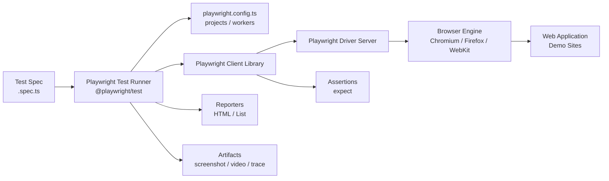
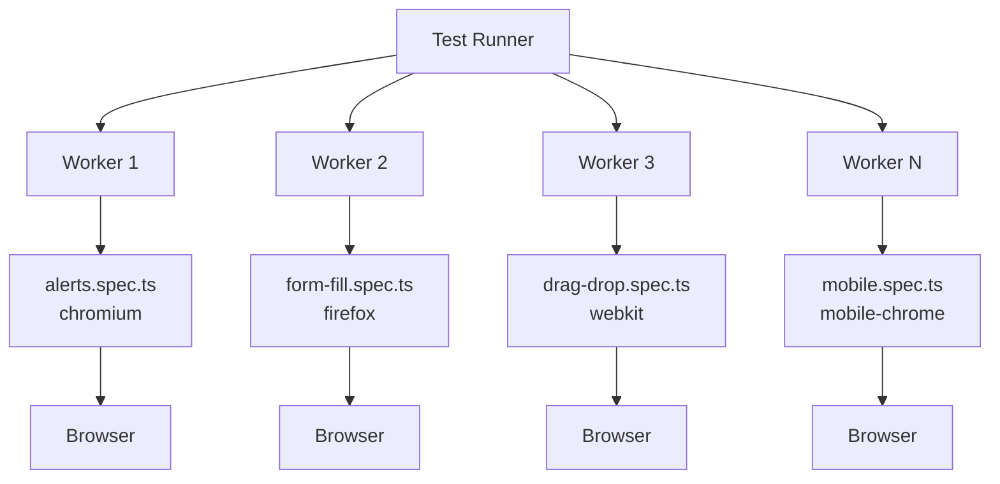

# Software Testing and Automation — MSE421IA

## Tool Demo Report on **"Playwright"**

**Submitted by**

| Name | USN |
|------|-----|
| _[Your Name]_ | _[Your USN]_ |

**Under the Guidance of**

**Dr. Merin Meleet**  
Associate Professor

**Submitted in partial fulfillment for the award of degree of**  
**MASTER OF TECHNOLOGY**  
**in Software Engineering**

**DEPARTMENT OF INFORMATION SCIENCE & ENGINEERING**  
**RV COLLEGE OF ENGINEERING®**  
**2025–26**

---

## CERTIFICATE

Certified that the Tool demo titled **"Playwright"** carried out by _[Student Name]_, USN: _[USN]_, bonafide student(s), submitted in partial fulfilment for the award of Master of Technology in Software Engineering of RV College of Engineering®, Bengaluru, affiliated to Visvesvaraya Technological University, Belagavi, during the year 2025–26. It is certified that all corrections/suggestions indicated for internal assessment have been incorporated in the report deposited in the departmental library. The report has been approved as it satisfies the academic requirement in respect of the course **"Software Testing and Automation (MSE421IA)"**, prescribed for the said degree.

| | |
|---|---|
| **Faculty in Charge** | **Head of the Department** |
| Dr. Merin Meleet | Dr. Mamatha G S |
| Associate Professor, Department of ISE | Department of ISE |

---

## ABSTRACT

Software testing plays a critical role in ensuring the quality, reliability, and performance of modern web applications. Manual testing, although effective for small-scale applications, becomes time-consuming, repetitive, and error-prone when applied to large and frequently updated systems. To address these limitations, automated testing tools have become an integral part of contemporary software development practices.

This report presents a comprehensive study of the **Playwright** automation testing tool, focusing on its architecture, features, installation process, working principles, and industrial applications. Playwright enables reliable automated interaction with web browsers by simulating real user actions such as clicking buttons, entering text, navigating pages, handling alerts, uploading files, and validating application behaviour. The framework supports multiple programming languages, browsers, and operating systems, and includes built-in capabilities such as auto-waiting, tracing, network interception, and API testing.

A hands-on demonstration project — **`playwright-demo`** — implements 22 automated test cases across 12 spec files, exercising 16 distinct Playwright capabilities against public demo web applications. The report compares Playwright with Selenium, Cypress, and UFT; discusses advantages, limitations, and real-world challenges; and maps demonstrated features to industrial and research applications.

Overall, Playwright has emerged as a powerful and modern web automation framework that enhances testing efficiency, reduces manual effort, and contributes significantly to improving software quality. Future advancements are expected to incorporate artificial intelligence techniques, self-healing mechanisms, and enhanced cloud integration to further strengthen automated testing capabilities.

---

## TABLE OF CONTENTS

| Sl. No. | Chapter Title | Status |
|--------:|---------------|--------|
| 1 | Introduction | ✅ Complete |
| 2 | Tool Overview | ✅ Complete |
| 3 | Installation and Setup | ✅ Complete |
| 4 | Versions and Release History | ✅ Complete |
| 5 | Comparison with Similar Tools | ✅ Complete |
| 6 | Features and Capabilities | ✅ Complete |
| 7 | Working Principle and Architecture | ✅ Complete |
| 8 | Demonstration and Use Cases | ✅ Complete |
| 9 | Advantages, Limitations and Challenges | ✅ Complete |
| 10 | Applications in Industry and Research | ✅ Complete |
| 11 | Conclusion and Future Work | ✅ Complete |
| — | Appendix A: Test Scripts Used for Demonstrations | ✅ Complete |

---

# CHAPTER 1 — INTRODUCTION

Software quality assurance has become an indispensable component of modern software development. With the rapid growth of internet technologies, web applications are increasingly being utilized in various domains such as banking, e-commerce, healthcare, education, and government services. Ensuring the reliability, functionality, and performance of these applications is essential to provide a seamless user experience and maintain software quality.

Traditionally, software testing was performed manually, where testers interacted with the application to verify its functionality. Although manual testing is effective for small-scale projects, it becomes inefficient for large and frequently updated applications. Manual testing is time-consuming, repetitive, susceptible to human errors, and difficult to execute consistently across multiple environments. As software systems continue to evolve rapidly — with frequent releases, responsive layouts, and complex client-side logic — organizations require automated testing solutions to improve testing efficiency and reduce development time.

**Automation testing** refers to the use of specialized software tools to execute test cases automatically, compare actual outcomes with expected results, and generate test reports with minimal human intervention. Automated testing significantly reduces testing effort, improves accuracy, enhances test coverage, and accelerates software delivery processes. Modern automation frameworks go beyond simple script playback: they provide intelligent waiting, rich debugging, parallel execution, and integration with continuous delivery pipelines.

**Playwright** is a modern open-source automation framework developed by **Microsoft** for reliable end-to-end testing of web applications. First released in **January 2020**, Playwright was designed to address common pain points in browser automation — flaky tests caused by timing issues, fragmented tooling across browsers, and limited debugging visibility. Unlike older approaches that relied heavily on external browser drivers and manual synchronization, Playwright provides **built-in auto-waiting**, a unified API across browsers, and first-class developer tools such as **Codegen**, **UI Mode**, and the **Trace Viewer**.

Playwright enables testers and developers to automate a wide range of user actions, including:

- Opening web pages and navigating between routes
- Filling forms, selecting dropdowns, and handling checkboxes and radio buttons
- Clicking buttons, links, and dynamic elements
- Handling JavaScript alerts, confirms, and prompts
- Working with pop-up windows and new browser tabs
- Interacting with elements inside iframes
- Uploading and downloading files
- Performing drag-and-drop, hover, keyboard, and mouse actions
- Mocking network requests and testing REST APIs without a browser

The framework supports multiple programming languages, including **TypeScript**, **JavaScript**, **Python**, **Java**, and **.NET**, thereby providing flexibility to automation engineers and development teams. Playwright ships with native support for **Chromium**, **Firefox**, and **WebKit** (Safari engine), enabling true cross-browser testing from a single configuration. It is compatible with major operating systems, including **Windows**, **Linux**, and **macOS**, and supports **mobile device emulation** through configurable viewport and user-agent profiles.

In addition to browser automation, Playwright integrates naturally with popular test runners, reporting tools, and **Continuous Integration / Continuous Deployment (CI/CD)** platforms. Features such as parallel test execution, HTML reports, screenshot and video capture on failure, and trace recording make it well suited for both local development and pipeline-based quality gates. Owing to its reliability, speed, and comprehensive tooling, Playwright has gained rapid adoption in industry and is frequently evaluated alongside established tools such as Selenium and Cypress.

### Scope of This Report

This report presents a detailed study of the Playwright automation testing tool, including its architecture, installation procedures, features, capabilities, industrial applications, advantages, limitations, and future scope. The report follows the same structure as a standard academic tool-demo submission and mirrors the demonstration approach used for Selenium — progressing from theory to hands-on implementation.

The practical component of this demo is implemented in the **`playwright-demo`** repository. The project contains a suite of focused test scripts that run against public sandbox web applications (such as [the-internet.herokuapp.com](https://the-internet.herokuapp.com) and [demoqa.com](https://demoqa.com)), covering scenarios including form filling, dialog handling, file upload/download, iframe interaction, network mocking, visual regression, cross-browser execution, mobile emulation, and API testing. Each scenario is tied to a concrete, relatable UI interaction that developers and quality-assurance engineers encounter in daily work.

Subsequent chapters document the tool in depth and explain how each demonstrated feature maps to Playwright APIs and project files within this repository.

---

# CHAPTER 2 — TOOL OVERVIEW

Playwright is a widely used open-source framework for automating web browsers. It provides a collection of tools and libraries that enable testers and developers to automate interactions with web applications in a manner similar to real user activities. Playwright is primarily employed for **functional testing**, **regression testing**, **cross-browser testing**, **end-to-end (E2E) validation**, and **API testing** within the same toolchain.

Playwright was developed by **Microsoft** and first released in **January 2020**. The team behind Playwright had prior experience building browser automation infrastructure at scale. Over subsequent releases, Playwright has evolved into one of the most preferred modern automation frameworks in the software testing industry due to its **reliability**, **built-in auto-waiting**, **unified cross-browser API**, and **rich developer tooling**.

Unlike conventional single-purpose testing utilities, Playwright does not provide only a scripting library. Instead, it consists of an integrated ecosystem of components that collectively facilitate comprehensive web automation — from recording tests and writing scripts to parallel execution, debugging, and reporting. The major components of the Playwright ecosystem are discussed below.

## 2.1 Playwright Codegen

**Playwright Codegen** is an interactive code-generation tool that supports record-and-playback functionality. It enables users to record browser interactions and automatically generate automation scripts without extensive prior programming knowledge.

Codegen is invoked from the command line:

```bash
npx playwright codegen https://demoqa.com/automation-practice-form
```

The primary features of Playwright Codegen include:

- Record and replay browser actions in real time
- Generate scripts in TypeScript, JavaScript, Python, Java, or C#
- Highlight locators and suggest resilient selectors (`getByRole`, `getByLabel`, etc.)
- Support rapid test case creation and prototyping
- Suitable for beginners, demos, and discovering correct locators for complex pages

Although Codegen is highly useful for quick wins and live demonstrations, complex production test suites typically require manual refinement of generated scripts — adding assertions, test data, fixtures, and structure. In this demo project, Codegen is recommended as the **opening step** in the live presentation before running the pre-written spec files.

## 2.2 Playwright Library and Test Runner

The **Playwright Library** is the core component of the framework. It communicates with browsers through Playwright's own automation protocol and executes commands such as navigation, clicking, typing, and assertions. The **`@playwright/test`** package extends the library with a full-featured test runner designed specifically for end-to-end testing.

The test runner provides a programming interface that allows users to create robust automation scripts. In this project, tests are written in **TypeScript** and stored under the `tests/` directory.

Major capabilities of the Playwright Library and Test Runner include:

- Browser automation using native, bundled browser engines
- Support for Chromium, Firefox, and WebKit from a single API
- Interaction with dynamic web elements through **auto-waiting** locators
- Handling alerts, frames, windows, and pop-ups
- Performing advanced user actions such as drag-and-drop, hover, and keyboard input
- File upload and download handling
- Network interception and API mocking via `page.route()`
- Capturing screenshots, videos, and traces as test evidence
- Built-in test assertions via the `expect` API

Due to its reliability and expressive API, Playwright Test is extensively used in industrial automation frameworks and is the component exercised by every spec file in the **`playwright-demo`** repository.

## 2.3 Playwright Test Runner — Parallel Execution and Projects

Where Selenium Grid provides distributed parallel execution across machines, Playwright achieves large-scale efficiency through **built-in parallel test execution** and **project-based browser configuration** — without requiring a separate grid server for most teams.

In `playwright.config.ts`, this demo project defines multiple **projects**:

| Project | Browser / Device |
|---------|------------------|
| `chromium` | Desktop Chrome |
| `firefox` | Desktop Firefox |
| `webkit` | Desktop Safari engine |
| `mobile-chrome` | iPhone 13 emulation |

The primary objectives of Playwright's parallel and multi-project model are:

- Reduce overall test execution time through `fullyParallel` and worker processes
- Execute the same test suite against multiple browsers automatically
- Support cross-browser and cross-platform testing from one configuration file
- Emulate mobile viewports without physical devices
- Facilitate scalable automation in local and CI environments

When `npm test` is executed, Playwright runs tests in parallel (by default using 50% of CPU cores) and repeats applicable tests across all configured projects — demonstrating cross-browser coverage in a single command.

## 2.4 Browser Installation and Management

Playwright includes **built-in browser management**, eliminating the need to manually download and configure separate drivers such as ChromeDriver or GeckoDriver (a common requirement in older Selenium setups).

The command:

```bash
npx playwright install
```

automatically:

- Downloads compatible builds of Chromium, Firefox, and WebKit
- Bundles required dependencies (e.g., FFmpeg for video recording)
- Keeps browser versions aligned with the installed Playwright package
- Simplifies setup for beginners and CI pipelines

This built-in management significantly reduces configuration overhead and is one of the key usability advantages of Playwright over legacy driver-based approaches.

## 2.5 Playwright Inspector, UI Mode, and Trace Viewer

Beyond Codegen and the core library, Playwright provides dedicated **debugging and demonstration tools** that have no direct equivalent in the classic Selenium suite:

### Playwright Inspector (`--debug`)

Runs tests in headed mode with step-by-step execution. Each action can be advanced manually, making it ideal for live classroom or viva demonstrations.

```bash
npx playwright test tests/alerts.spec.ts --debug --project=chromium
```

### UI Mode (`--ui`)

Opens a graphical test explorer where users can select tests, watch the browser execute actions, and inspect each step in a timeline — the recommended interface for interactive demos.

```bash
npm run test:ui
```

### Trace Viewer

Records a complete trace of test execution — DOM snapshots, network activity, console logs, and screenshots — viewable after a run:

```bash
npm run test:trace
npx playwright show-trace test-results/<run>/trace.zip
```

These tools are central to showcasing automation **visually** to an audience and are highlighted in Chapter 8 of this report.

## 2.6 Characteristics of Playwright

Playwright possesses several characteristics that make it a powerful automation framework:

1. **Open-source** and freely available under the Apache 2.0 license
2. Supports multiple programming languages (TypeScript, JavaScript, Python, Java, .NET)
3. Provides **true cross-browser** compatibility via Chromium, Firefox, and WebKit
4. Supports execution on Windows, Linux, and macOS
5. Includes **built-in auto-waiting**, reducing flaky tests caused by timing issues
6. Facilitates integration with CI/CD platforms, GitHub Actions, and reporting tools
7. Enables parallel test execution and multi-project configurations out of the box
8. Supports automation of dynamic web applications, SPAs, and modern JavaScript frameworks
9. Provides first-class **API testing** through the `request` fixture (no browser required)
10. Offers official documentation, active community, and Microsoft-backed maintenance

Because of these characteristics, Playwright has become a leading automation tool in both **academic tool-demo evaluations** and **industrial software testing environments**. The `playwright-demo` project in this repository is structured to exercise each of these characteristics through focused, demonstrable test scenarios.

---

# CHAPTER 3 — INSTALLATION AND SETUP

The successful implementation of Playwright automation requires proper installation and configuration of the necessary hardware and software components. Playwright is a flexible automation framework that supports multiple programming languages, browsers, and operating systems. Therefore, the installation procedure may vary depending on the selected technology stack and testing environment.

For this tool demo, the project uses **TypeScript** with **Node.js** and the **`@playwright/test`** runner. This chapter presents the general system requirements, software prerequisites, step-by-step setup process, environment configuration, and project organization used in the **`playwright-demo`** repository.

## 3.1 System Requirements

The minimum hardware requirements for installing and executing Playwright automation scripts are presented in Table 3.1.

**Table 3.1: System Requirements**

| Component | Minimum Requirement |
|-----------|---------------------|
| Processor | Intel Core i3 or equivalent (Apple Silicon supported) |
| RAM | 4 GB (8 GB recommended for parallel multi-browser runs) |
| Storage | 2 GB free disk space (additional ~500 MB per browser engine) |
| Operating System | Windows 10+, Linux, or macOS |
| Internet Connectivity | Required for npm packages, browser downloads, and demo site access |

The recommended configuration may vary depending on the number of parallel workers, browsers installed, and whether video/trace artifacts are retained. Running the full suite across Chromium, Firefox, WebKit, and mobile emulation (88 test runs) benefits from 8 GB RAM and a stable network connection.

## 3.2 Software Requirements

The software components required for Playwright automation include:

- A supported operating system (Windows, Linux, or macOS)
- **Node.js** runtime (version 18 or higher)
- **npm** (or yarn/pnpm) for package management
- The **`@playwright/test`** library and its bundled browser engines
- An Integrated Development Environment (IDE) or code editor
- Network access to demo web applications used by the test suite

Unlike Selenium, Playwright does **not** require separate browser driver downloads (ChromeDriver, GeckoDriver, etc.). Browser binaries are managed by the Playwright CLI.

The commonly used software tools for this demo project are listed in Table 3.2.

**Table 3.2: Common Software Requirements**

| Software Component | Purpose |
|--------------------|---------|
| Node.js (18+) | JavaScript/TypeScript runtime |
| npm | Dependency and script management |
| `@playwright/test` | Test runner, assertions, and browser automation |
| TypeScript | Typed test script development |
| Visual Studio Code / Cursor | Script development, debugging, and terminal |
| Bundled Chromium, Firefox, WebKit | Cross-browser test execution |
| Demo web applications | Target applications under test |

## 3.3 Installation Procedure

The procedure for setting up the **`playwright-demo`** project consists of the following steps.

### Step 1: Install Node.js

Playwright's JavaScript/TypeScript bindings require Node.js. Download and install the LTS version from [https://nodejs.org](https://nodejs.org).

Verify installation:

```bash
node --version    # Expected: v18.x or higher
npm --version
```

### Step 2: Install an Integrated Development Environment

An appropriate IDE or code editor should be installed to facilitate script development, execution, and debugging. For this project, **Visual Studio Code** or **Cursor** is recommended.

These environments provide:

- Syntax highlighting and IntelliSense for TypeScript
- Integrated terminal for running `npm` and `npx playwright` commands
- File explorer for navigating `tests/`, `fixtures/`, and configuration files
- Optional Playwright extension for test discovery and debugging

### Step 3: Clone or Obtain the Project

Navigate to the project directory:

```bash
cd playwright-demo
```

The repository contains the test suite, configuration, fixtures, and documentation required for the tool demo.

### Step 4: Install Project Dependencies

Install Node.js packages defined in `package.json`:

```bash
npm install
```

This installs `@playwright/test` (currently `^1.61.1`) and its dependencies into `node_modules/`.

### Step 5: Install Playwright Browsers

Download the browser engines used by the test projects:

```bash
npx playwright install
```

To install only specific browsers (faster setup for demos):

```bash
npx playwright install chromium          # Chromium only
npx playwright install chromium firefox webkit   # All three desktop engines
```

Playwright automatically downloads compatible browser builds and dependencies (including FFmpeg for video recording). No manual driver configuration is required.

### Step 6: Verify Installation

Run the test suite on a single browser to confirm the environment is configured correctly:

```bash
npm run test:chromium
```

A successful run should report **21 passed** tests (with 1 skipped mobile-only test on the chromium project). Alternatively, run a single spec in headed mode for a visual confirmation:

```bash
npx playwright test tests/alerts.spec.ts --headed --project=chromium
```

Successful browser launch, navigation to the demo page, and test completion confirm proper installation.

## 3.4 Environment Configuration

Environment configuration for Playwright involves setting up the test runner, browser projects, reporters, and artifact capture policies. In this demo, all configuration is centralized in **`playwright.config.ts`**.

Key configuration settings used in this project:

| Setting | Value | Purpose |
|---------|-------|---------|
| `testDir` | `./tests` | Location of all spec files |
| `fullyParallel` | `true` | Run tests in parallel for faster execution |
| `reporter` | `html`, `list` | Console output + HTML report generation |
| `use.trace` | `on-first-retry` | Capture trace on flaky retry |
| `use.screenshot` | `only-on-failure` | Screenshot evidence on failure |
| `use.video` | `retain-on-failure` | Video recording on failure |
| `projects` | chromium, firefox, webkit, mobile-chrome | Cross-browser and mobile emulation |

The configuration process generally includes:

- Defining browser **projects** for cross-browser coverage
- Setting worker count for parallel execution (defaults to 50% of CPU cores locally)
- Configuring reporters for demo and CI use (`npx playwright show-report`)
- Managing project dependencies via `package.json` scripts
- Verifying browser compatibility across projects with `npm test`

No environment variables or manual driver paths are required for local execution. Optional variables such as `CI=true` adjust retry and worker behaviour automatically via the config file.

### Available npm Scripts

The following scripts are defined in `package.json` for convenient execution:

| Script | Command | Purpose |
|--------|---------|---------|
| `npm test` | `playwright test` | Run all tests across all projects |
| `npm run test:chromium` | `--project=chromium` | Single-browser run (fastest) |
| `npm run test:firefox` | `--project=firefox` | Firefox-only run |
| `npm run test:webkit` | `--project=webkit` | WebKit-only run |
| `npm run test:mobile` | `--project=mobile-chrome` | Mobile emulation run |
| `npm run test:ui` | `--ui` | Interactive UI mode for demos |
| `npm run test:headed` | `--headed` | Visible browser during execution |
| `npm run test:trace` | `--trace on` | Record trace on every run |

## 3.5 Project Organization

A well-structured automation project improves maintainability, scalability, and reusability. The **`playwright-demo`** project organizes test scripts, fixtures, configuration, and documentation into separate directories.

**Table 3.3: Project Directory Structure**

| Path | Purpose |
|------|---------|
| `tests/` | All `.spec.ts` test files, one file per demo feature |
| `tests/visual-regression.spec.ts-snapshots/` | Baseline screenshots for visual comparison |
| `fixtures/` | Static test data (e.g., `sample-upload.txt` for file upload demo) |
| `playwright.config.ts` | Central runner, browser projects, reporters, and artifact settings |
| `package.json` | Dependencies and npm scripts |
| `tsconfig.json` | TypeScript compiler options |
| `README.md` | Quick-start guide and feature map |
| `project-documentation.md` | Full academic tool-demo report (this document) |
| `playwright-report/` | Generated HTML report (after test run) |
| `test-results/` | Screenshots, videos, traces from test runs |

**Test files in `tests/`:**

| File | Demonstrates |
|------|-------------|
| `form-fill.spec.ts` | Multi-field form automation |
| `alerts.spec.ts` | JavaScript dialog handling |
| `popups.spec.ts` | New tab / window capture |
| `iframe.spec.ts` | Nested iframe interaction |
| `file-upload.spec.ts` | File input upload |
| `file-download.spec.ts` | Download capture and verification |
| `drag-drop.spec.ts` | Drag-and-drop actions |
| `hover.spec.ts` | Hover, keyboard, and mouse actions |
| `network-mocking.spec.ts` | API interception and mocking |
| `visual-regression.spec.ts` | Screenshot baseline comparison |
| `api-testing.spec.ts` | REST API testing without browser |
| `mobile.spec.ts` | Mobile viewport emulation |

Proper project organization offers several advantages:

- **Improved readability** — each spec file maps to one demonstrable feature
- **Easier maintenance** — changes to a scenario are isolated to a single file
- **Better scalability** — new demos add new spec files without restructuring
- **Efficient collaboration** — clear separation between tests, config, fixtures, and docs

Adopting this standardized structure aligns with best practices in industrial automation environments and makes the project suitable for academic demonstration, viva examination, and future extension.

---

# CHAPTER 4 — VERSIONS AND RELEASE HISTORY

Playwright has undergone significant evolution since its inception, continuously adapting to the changing requirements of web application testing. Although younger than Selenium, the framework has progressed rapidly from a cross-browser automation library to a comprehensive end-to-end testing platform with integrated tooling, multi-language support, and industry adoption. Each major release introduced new capabilities, improved browser compatibility, and enhanced developer experience.

Unlike Selenium's decades-long progression through Core, RC, and WebDriver architectures, Playwright was designed from the outset with a **modern protocol**, **bundled browsers**, and **built-in auto-waiting**. Its release history reflects frequent, incremental improvements rather than infrequent major rewrites.

## 4.1 Origins and Announcement (2019)

The origins of Playwright can be traced to Microsoft's browser automation engineering efforts and the team's prior work on **Puppeteer** — a Node.js library for controlling Chromium. While Puppeteer demonstrated the value of a high-level, reliable browser API, it was limited primarily to Chromium-based browsers.

In **2019**, Microsoft announced **Playwright** as a next-generation automation framework with a deliberate goal: provide a **single API** that works consistently across **Chromium**, **Firefox**, and **WebKit** (the engine behind Safari). The founding team included engineers with deep experience in browser internals and large-scale web testing infrastructure.

Key motivations behind Playwright's creation included:

- Eliminating flaky tests caused by manual waits and race conditions
- Reducing the complexity of managing separate browser drivers
- Enabling realistic cross-browser testing beyond Chromium-only tools
- Providing rich debugging and developer tooling as first-class features

This foundation positioned Playwright as a direct response to limitations observed in both legacy WebDriver-based tools and Chromium-only automation libraries.

## 4.2 Playwright 1.0 (May 2020)

Playwright **version 1.0** was officially released on **6 May 2020**, marking the framework's transition from preview to production-ready status.

The 1.0 release shipped with bundled browser versions:

| Browser | Version at 1.0 Release |
|---------|----------------------|
| Chromium | 84.0.4135.0 |
| Mozilla Firefox | 76.0b5 |
| WebKit | 13.0.4 |

Major contributions of Playwright 1.0 include:

- A unified API for automating Chromium, Firefox, and WebKit
- **Auto-waiting** for elements to be actionable before performing interactions
- Support for multiple browser contexts and pages within a single session
- Network interception, mobile emulation, and geolocation simulation
- Headless and headed execution modes
- Initial JavaScript/TypeScript and Python language bindings

Playwright 1.0 laid the technical foundation that distinguishes the framework from older driver-based approaches: browsers and automation logic are managed as an integrated stack rather than as loosely coupled components.

## 4.3 Playwright Test Runner (2020–2021)

Following the core library release, Microsoft introduced **`@playwright/test`** — a purpose-built test runner for end-to-end testing. This component parallels the role of Selenium WebDriver within the Selenium ecosystem but extends further by including assertions, fixtures, parallelization, and reporting in one package.

Key developments during this period include:

- **Test fixtures** — `page`, `context`, `browser`, and `request` provided automatically to each test
- **Built-in assertions** — `expect(locator).toBeVisible()` and related web-first matchers
- **Parallel execution** — tests run concurrently via worker processes
- **Project configuration** — multiple browser/device profiles in `playwright.config.ts`
- **HTML reporter** — visual test results for local and CI consumption
- **Codegen** — record-and-playback tool for generating test scripts (`npx playwright codegen`)

The **`playwright-demo`** project in this report uses `@playwright/test` as its primary execution engine, demonstrating the mature state of the test runner ecosystem.

## 4.4 Trace Viewer and Enhanced Debugging (2021 Onward)

As Playwright adoption grew in continuous integration environments, debugging failed tests remotely became a critical requirement. Microsoft introduced and iteratively enhanced the **Playwright Trace Viewer** — a GUI tool for exploring recorded test traces after execution.

Trace Viewer capabilities include:

- Step-by-step action timeline with duration per step
- DOM snapshots before and after each action
- Network request log with headers and response bodies
- Console output and source location for each step
- Screenshot and screencast playback within the trace

Traces are configured in `playwright.config.ts` (this demo uses `trace: 'on-first-retry'`) and viewed via:

```bash
npx playwright show-trace test-results/<run>/trace.zip
```

The Trace Viewer has become one of Playwright's most praised features for diagnosing flaky or failed tests and is a highlight of the live demonstration described in Chapter 8.

## 4.5 Multi-Language Bindings and Component Testing (2021–2022)

Playwright expanded beyond JavaScript and Python to provide official support for **Java** and **.NET**, enabling enterprise teams to adopt the framework within their existing technology stacks. Each language port maintains API parity with the core library while integrating with native test frameworks where appropriate.

During this period, Microsoft also introduced **experimental component testing** (`@playwright/experimental-ct-react`, `@playwright/experimental-ct-vue`, etc.), allowing individual UI components to be tested in isolation without a full browser navigation flow. While component testing is a separate use case from the end-to-end scenarios in this demo, it demonstrates Playwright's expansion beyond traditional page-level automation.

Additional capabilities added across 2021–2022 releases include:

- Improved locator strategies (`getByRole`, `getByLabel`, `getByText`, `getByTestId`)
- `page.route()` enhancements for network mocking and HAR replay
- Visual comparison assertions (`toHaveScreenshot()`)
- Clock mocking for time-dependent UI testing
- Continuous browser version updates bundled with each Playwright release

## 4.6 UI Mode and Integrated Developer Experience (2023)

**Playwright version 1.32** (March 2023) introduced **UI Mode** — a graphical test explorer that significantly improved the local development and demonstration experience.

UI Mode provides:

- A visual list of all tests with pass/fail/skip status
- One-click test execution with a live browser preview
- Built-in watch mode for re-running tests on file changes
- Integrated trace and action timeline per test
- Project filter for running tests on specific browsers

UI Mode is invoked via:

```bash
npx playwright test --ui
```

This feature is the recommended interface for **live classroom demonstrations** and was referenced throughout the setup and demo chapters of this report. Version 1.35 (June 2023) further integrated UI Mode with the VS Code Playwright extension and improved trace viewer accessibility in browser tabs.

## 4.7 Continuous Evolution (2024–2026)

Playwright follows a **continuous release model**, shipping frequent updates (typically multiple releases per month) rather than infrequent major versions. This approach ensures compatibility with the latest browser builds and steady delivery of improvements.

Notable themes in recent releases (versions 1.40 through **1.61**, used in this demo project) include:

- Trace Viewer and UI Mode UX refinements (search, themes, network panel improvements)
- Enhanced HTML reporter with better failure analysis
- Improved `getByRole` and accessibility-oriented locator defaults
- AI-assisted test generation features and agent tooling (emerging in 2025–2026 releases)
- Performance optimizations for parallel execution and large test suites
- Ongoing browser version bumps (Chromium, Firefox, WebKit) with each release

**Table 4.1: Playwright Version Used in This Demo**

| Component | Version |
|-----------|---------|
| `@playwright/test` | ^1.61.1 |
| Node.js requirement | 18+ |
| Browser projects | Chromium, Firefox, WebKit, iPhone 13 emulation |

Because Playwright uses semantic versioning with a `1.x` major line, breaking changes are rare and documented in release notes. Teams are encouraged to keep Playwright updated to maintain browser compatibility.

## 4.8 Release Timeline of Playwright

The major milestones in Playwright's evolution are summarized in Table 4.2.

**Table 4.2: Major Playwright Versions and Their Contributions**

| Year | Version / Milestone | Major Contribution |
|------|---------------------|-------------------|
| 2019 | Announcement | Cross-browser automation framework announced by Microsoft |
| 2020 | Playwright 1.0 | Unified Chromium/Firefox/WebKit API; auto-waiting; bundled browsers |
| 2020–2021 | `@playwright/test` | Dedicated test runner, fixtures, parallel execution, HTML reporter |
| 2021 | Trace Viewer | Post-mortem debugging with DOM snapshots, network, and console |
| 2021–2022 | Language expansion | Java, .NET bindings; component testing (experimental) |
| 2022 | Locator improvements | `getByRole`, `getByLabel`; web-first assertions |
| 2023 | v1.32 — UI Mode | Graphical test explorer with watch mode and live browser preview |
| 2023 | v1.35 | UI Mode in VS Code extension; trace viewer in browser tab |
| 2024–2026 | v1.40 – v1.61 | Continuous browser updates, reporting/trace UX, agent tooling |

The rapid evolution of Playwright demonstrates its ability to adapt to emerging web technologies and modern software delivery practices. Owing to regular updates, Microsoft-backed maintenance, and active community adoption, Playwright has established itself as a leading alternative to Selenium and Cypress in both **academic evaluations** and **industrial testing environments** — despite having a shorter history than Selenium.

---

# CHAPTER 5 — COMPARISON WITH SIMILAR TOOLS

The increasing demand for automated software testing has led to the development of numerous automation frameworks and testing tools. Although **Playwright** is a modern and rapidly growing framework, several established alternatives — including **Selenium**, **Cypress**, and **Unified Functional Testing (UFT)** — are also extensively used in software testing environments. Each tool possesses distinct characteristics, strengths, and limitations.

A comparative analysis of Playwright with other popular automation tools is essential to understand its position in the software testing ecosystem and to identify the scenarios in which Playwright offers significant advantages over legacy or competing solutions. This chapter presents that analysis from the perspective of Playwright as the tool under study in this demo report.

## 5.1 Playwright versus Selenium

**Selenium** is the most widely adopted open-source web automation framework, with a history spanning more than two decades. Selenium WebDriver communicates with browsers through **browser-specific drivers** (ChromeDriver, GeckoDriver, etc.) and supports a vast ecosystem of language bindings, third-party frameworks, and enterprise integrations.

**Playwright**, developed by Microsoft and first released in 2020, takes a different architectural approach. It bundles browser binaries, uses its own automation protocol, and provides **built-in auto-waiting** — reducing the flaky-test problems that often plague Selenium scripts requiring explicit waits.

| Aspect | Selenium | Playwright |
|--------|----------|------------|
| Architecture | WebDriver + external browser drivers | Bundled browsers + unified protocol |
| Auto-waiting | Manual / framework-dependent | Built into every action |
| Test runner | External (TestNG, JUnit, pytest, etc.) | Built-in `@playwright/test` |
| Debugging | Browser DevTools + third-party tools | Trace Viewer, UI Mode, Inspector |
| Browser support | Extensive (via drivers) | Chromium, Firefox, WebKit (bundled) |
| Community / maturity | Very large, decades of adoption | Growing rapidly, Microsoft-backed |
| Learning curve | Steeper (driver setup, waits, grid) | Lower for new projects (single `npm install`) |

**Playwright advantages:** faster setup, fewer flaky tests, integrated tracing and reporting, native parallel execution and multi-project configuration without Selenium Grid.

**Selenium advantages:** largest community and job-market presence, widest language and framework integration, extensive legacy enterprise adoption, support for older browser versions through driver management.

For **new end-to-end projects** — such as the `playwright-demo` repository — Playwright typically requires less boilerplate and configuration. For **large existing Selenium estates**, migration cost and ecosystem inertia may favour retaining Selenium.

## 5.2 Playwright versus Cypress

**Cypress** is a modern front-end testing framework designed for web applications. Unlike Selenium's driver model, Cypress historically executed tests **inside the browser** (with a Node.js plugin for orchestration), providing fast feedback and an excellent developer experience for JavaScript/TypeScript teams.

| Aspect | Cypress | Playwright |
|--------|---------|------------|
| Primary languages | JavaScript, TypeScript | TypeScript, JS, Python, Java, .NET |
| Browser support | Chromium-family primary; limited multi-browser | Chromium, Firefox, WebKit natively |
| Tab / window handling | Limited (single-tab focus historically) | Full multi-tab and popup support |
| iframe support | More challenging | First-class `frameLocator()` API |
| Network mocking | Built-in `cy.intercept()` | Built-in `page.route()` |
| Parallel execution | Requires Cypress Cloud or custom setup | Built-in via workers and projects |
| API testing | Limited | Native `request` fixture |
| Mobile emulation | Limited | Device profiles in config |

**Playwright advantages:** true cross-browser testing (including WebKit/Safari), better multi-tab and iframe handling (demonstrated in `popups.spec.ts` and `iframe.spec.ts`), built-in parallel execution, and API testing without a browser.

**Cypress advantages:** exceptionally polished developer experience for React/Vue SPAs, large JavaScript community, intuitive time-travel debugging in the Cypress runner, strong documentation for front-end developers.

Cypress and Playwright both target modern web applications and emphasise developer experience. Playwright is generally preferred when **cross-browser coverage**, **multi-tab workflows**, or **multi-language teams** are priorities — all of which are demonstrated in this project.

## 5.3 Playwright versus Unified Functional Testing (UFT)

**Unified Functional Testing (UFT)**, previously known as Quick Test Professional (QTP), is a **commercial** automation tool developed by OpenText (formerly Micro Focus). Unlike Playwright, which is open-source and free, UFT requires a **licensed subscription** — making it less accessible in academic environments.

| Aspect | UFT | Playwright |
|--------|-----|------------|
| License | Commercial (paid) | Open source (Apache 2.0) |
| Target applications | Web, desktop, legacy enterprise | Web (primary); API via request context |
| Object repository | Built-in GUI object spy | Code-based locators (`getByRole`, etc.) |
| Scripting | VBScript (primary) | TypeScript, JS, Python, Java, .NET |
| Reporting | Built-in enterprise reports | HTML report + Trace Viewer |
| CI/CD integration | Supported (vendor tooling) | Excellent (GitHub Actions, Jenkins, etc.) |
| Cost | High licensing fees | Free |

**Playwright advantages:** zero licensing cost, modern code-first approach, version control friendly (plain text test files), strong CI/CD integration, and alignment with contemporary development practices using TypeScript/JavaScript.

**UFT advantages:** integrated test management, object repository for non-programmers, vendor support and training, support for legacy desktop and enterprise applications beyond web browsers.

For academic tool demos and modern web-only automation — as in this MSE421IA submission — Playwright is significantly more practical due to **cost**, **accessibility**, and **alignment with industry development stacks**.

## 5.4 Comparative Analysis

Table 5.1 presents a comparative analysis of Playwright and other popular automation tools based on various evaluation parameters relevant to this demo project.

**Table 5.1: Comparison of Playwright with Similar Automation Tools**

| Feature | Playwright | Selenium | Cypress | UFT |
|---------|------------|----------|---------|-----|
| License type | Open source | Open source | Open source | Commercial |
| Programming language support | TypeScript, JS, Python, Java, .NET | Java, Python, C#, JS, Ruby, etc. | JavaScript, TypeScript | Primarily VBScript |
| Browser support | Chromium, Firefox, WebKit (bundled) | Extensive (via drivers) | Chromium-focused; improving | Moderate |
| Cross-platform support | Yes | Yes | Yes | Limited |
| Built-in auto-waiting | Yes | No (manual/framework) | Yes | Partial |
| Parallel execution | Built-in (workers + projects) | Via Selenium Grid / frameworks | Via Cypress Cloud / plugins | Supported |
| Multi-tab / popup support | Excellent | Good | Limited | Good |
| Network mocking | `page.route()` | Via proxies / libraries | `cy.intercept()` | Limited |
| API testing (no browser) | `request` fixture | Via separate libraries | Limited | Supported |
| Trace / debug tooling | Trace Viewer, UI Mode, Inspector | Third-party / DevTools | Time-travel runner | Vendor IDE |
| Mobile emulation | Device profiles in config | Via Appium | Limited | Supported |
| Community support | Large and growing | Very large | Large | Vendor-based |
| CI/CD integration | Excellent | Excellent | Good | Good |
| Cost | Free | Free | Free (Cloud paid) | Licensed |
| Best suited for | Modern E2E, cross-browser, CI | Enterprise legacy, multi-language | JS SPA front-end teams | Enterprise desktop + web |

From the comparative analysis, it can be observed that **Playwright provides a strong combination of modern developer experience, cross-browser reliability, integrated tooling, and zero cost**. While Selenium retains advantages in ecosystem maturity and industry tenure, and Cypress excels in JavaScript-centric SPA workflows, Playwright addresses many pain points of older frameworks — particularly **flaky tests**, **driver management**, and **debugging visibility**.

The `playwright-demo` project was intentionally built on Playwright rather than Selenium or Cypress because it allows a single repository to demonstrate:

- Cross-browser execution (Chromium, Firefox, WebKit) from one config file
- Multi-tab and iframe scenarios that are cumbersome in Cypress
- Network mocking and API testing in the same test runner
- Trace Viewer and UI Mode for live academic demonstration
- Zero licensing cost suitable for classroom and viva evaluation

Consequently, Playwright represents a **modern and well-rounded choice** for academic tool-demo submissions and for teams starting new end-to-end automation initiatives, while Selenium remains relevant for maintaining existing large-scale enterprise frameworks.

---

# CHAPTER 6 — FEATURES AND CAPABILITIES

Playwright provides a comprehensive set of features that enable efficient automation of modern web applications. Its built-in auto-waiting, cross-browser support, integrated test runner, and first-class debugging tools have made it one of the fastest-growing automation frameworks in the software testing industry. The major features and capabilities of Playwright are discussed in the following sections, with references to how each is demonstrated in the **`playwright-demo`** project.

## 6.1 Cross-Browser Testing

One of the most significant features of Playwright is its ability to perform **true cross-browser testing** from a single API. Modern web applications are expected to function consistently across different browsers. Playwright enables automation scripts to be executed on **Chromium** (Chrome/Edge), **Mozilla Firefox**, and **WebKit** (Safari engine) using bundled browser binaries — without separate driver downloads.

In this demo project, cross-browser testing is configured through **projects** in `playwright.config.ts`:

```typescript
projects: [
  { name: 'chromium', use: { ...devices['Desktop Chrome'] } },
  { name: 'firefox',  use: { ...devices['Desktop Firefox'] } },
  { name: 'webkit',   use: { ...devices['Desktop Safari'] } },
]
```

Running `npm test` executes the full suite against all three browser engines, allowing testers to identify browser-specific issues automatically.

## 6.2 Cross-Platform Support

Playwright supports execution on various operating systems, including **Windows**, **Linux**, and **macOS**. Automation scripts developed on one platform can generally be executed on another with minimal or no modifications, provided Node.js and Playwright browsers are installed.

This flexibility allows organizations — and academic demo environments — to perform testing in diverse environments and ensures greater portability of automation frameworks. The demo project was developed and verified on **macOS** and uses only cross-platform npm scripts and configuration.

## 6.3 Support for Multiple Programming Languages

Playwright provides official libraries for several programming languages, enabling automation engineers to develop scripts using their preferred technology stack:

| Language | Package |
|----------|---------|
| TypeScript / JavaScript | `@playwright/test` |
| Python | `playwright` (pytest integration) |
| Java | `com.microsoft.playwright` |
| .NET | `Microsoft.Playwright` |

The **`playwright-demo`** project uses **TypeScript**, the most common choice for Playwright projects. Language independence allows development and testing teams to integrate Playwright into existing ecosystems without mandating a specific backend language.

## 6.4 Web Element Interaction

Playwright enables interaction with the full range of web elements found in modern applications. It automates user actions such as entering text into input fields, clicking buttons, selecting options from dropdown menus, and interacting with checkboxes, radio buttons, and date pickers.

The **`form-fill.spec.ts`** test demonstrates comprehensive element interaction on [demoqa.com](https://demoqa.com/automation-practice-form):

- Text inputs (First Name, Last Name, Email, Mobile, Address)
- Radio buttons (Gender)
- Checkboxes (Hobbies)
- Date picker (Date of Birth)
- Dropdown/combobox (State and City)
- Submit button and modal confirmation

Playwright's auto-waiting ensures each interaction occurs only when the target element is ready, even on dynamically loaded pages.

## 6.5 Locator Strategies

Efficient identification of web elements is essential for successful automation. Playwright provides **web-first locators** that mirror how users and assistive technologies perceive the page:

| Locator | Example | Priority |
|---------|---------|----------|
| `getByRole` | `getByRole('button', { name: 'Submit' })` | Highest (accessibility tree) |
| `getByLabel` | `getByLabel('Male', { exact: true })` | High |
| `getByPlaceholder` | `getByPlaceholder('First Name')` | High |
| `getByText` | `getByText('Thanks for submitting')` | Medium |
| `getByTestId` | `getByTestId('login-button')` | Medium |
| CSS / XPath | `locator('#uploaded-files')` | Fallback |

Playwright recommends **role-based locators** (`getByRole`, `getByLabel`) over brittle CSS/XPath selectors. The demo project uses `getByPlaceholder`, `getByLabel`, and `getByRole` throughout `form-fill.spec.ts` and other specs to demonstrate resilient locator practices.

## 6.6 Auto-Waiting and Synchronization

Modern web applications frequently contain dynamically loaded content. Unlike Selenium — which requires explicit `implicit`, `explicit`, or `fluent` waits — Playwright performs **automatic waiting** before every action. The framework waits for elements to be:

- Attached to the DOM
- Visible
- Stable (not animating)
- Enabled
- Receiving events (not obscured)

This eliminates a major source of flaky tests. The **`form-fill.spec.ts`** test navigates demoqa.com with `waitUntil: 'domcontentloaded'` and relies on Playwright's auto-wait for all subsequent interactions — no `sleep()` or manual `waitForTimeout()` calls are used.

## 6.7 Handling Alerts, Frames, and Windows

Web applications often contain JavaScript dialogs, iframes, and multiple browser windows. Playwright provides dedicated APIs for each:

| Scenario | Playwright API | Demo spec |
|----------|---------------|-----------|
| `alert()`, `confirm()`, `prompt()` | `page.on('dialog', ...)` | `alerts.spec.ts` |
| New tab / window | `page.waitForEvent('popup')` | `popups.spec.ts` |
| iframe content | `page.frameLocator()` | `iframe.spec.ts` |

The **`alerts.spec.ts`** file demonstrates accepting, dismissing, and reading text from all three JavaScript dialog types. **`popups.spec.ts`** captures a new tab and asserts content on it. **`iframe.spec.ts`** reads and interacts with content inside nested iframes on the-internet.herokuapp.com.

## 6.8 Advanced User Interactions

Playwright supports advanced user interactions that simulate complex human behaviour:

| Interaction | API | Demo spec |
|-------------|-----|-----------|
| Hover | `locator.hover()` | `hover.spec.ts` |
| Drag and drop | `locator.dragTo()` | `drag-drop.spec.ts` |
| Double-click | `locator.dblclick()` | `hover.spec.ts` |
| Right-click | `click({ button: 'right' })` | `hover.spec.ts` |
| Keyboard input | `page.keyboard.press()` | `hover.spec.ts` |
| File upload | `setInputFiles()` | `file-upload.spec.ts` |
| File download | `waitForEvent('download')` | `file-download.spec.ts` |

These capabilities are essential for automating modern interactive web applications with rich UI patterns.

## 6.9 Screenshot, Video, and Visual Regression

Playwright provides built-in visual evidence capture during test execution:

| Capability | Configuration | Purpose |
|------------|--------------|---------|
| Screenshots on failure | `screenshot: 'only-on-failure'` | Failure evidence |
| Video on failure | `video: 'retain-on-failure'` | Replay failed runs |
| Visual regression | `expect(locator).toHaveScreenshot()` | Detect UI changes |
| Trace recording | `trace: 'on-first-retry'` | Full debug timeline |

The **`visual-regression.spec.ts`** test captures a baseline screenshot of the login form on the-internet.herokuapp.com and compares subsequent runs against it. Baseline images are stored in `tests/visual-regression.spec.ts-snapshots/`.

## 6.10 Parallel and Multi-Project Test Execution

Playwright Test supports **parallel execution** out of the box without requiring a separate grid server. Configuration options include:

- `fullyParallel: true` — all tests in all files run in parallel
- `workers` — number of concurrent worker processes (defaults to 50% of CPU cores)
- `projects` — define browser/device combinations that multiply test coverage

When `npm test` is run, the demo suite executes **88 test runs** (22 tests × 4 projects) in parallel, significantly reducing total execution time compared to sequential execution. This replaces the distributed hub-node model of Selenium Grid for most team-scale testing needs.

## 6.11 Network Interception, API Testing, and External Integration

Playwright extends beyond browser UI automation with integrated network and API capabilities:

**Network mocking** — `page.route()` intercepts HTTP requests and returns mock responses. The **`network-mocking.spec.ts`** file demonstrates:

- Replacing an API response with custom JSON
- Simulating a 500 server error
- Introducing artificial network delay

**API testing** — the `request` fixture sends HTTP requests without launching a browser. The **`api-testing.spec.ts`** file validates GET, POST, and response headers against [jsonplaceholder.typicode.com](https://jsonplaceholder.typicode.com).

**External tool integration** — Playwright integrates with:

- **CI/CD** — GitHub Actions, Jenkins, GitLab CI, Azure Pipelines
- **Reporters** — HTML, JSON, JUnit, GitHub, Blob
- **Version control** — plain-text TypeScript test files in Git
- **IDEs** — VS Code / Cursor with Playwright extension

## 6.12 Mobile Emulation, Debugging Tools, and Scalability

Playwright provides **mobile device emulation** through predefined device profiles:

```typescript
{ name: 'mobile-chrome', use: { ...devices['iPhone 13'] } }
```

The **`mobile.spec.ts`** test verifies viewport dimensions and page rendering under iPhone 13 emulation.

**Debugging and demonstration tools** include:

| Tool | Command | Purpose |
|------|---------|---------|
| UI Mode | `npm run test:ui` | Graphical test explorer for live demos |
| Inspector | `--debug` | Step-by-step execution |
| Codegen | `npx playwright codegen <url>` | Record and generate scripts |
| Trace Viewer | `npx playwright show-trace` | Post-run timeline replay |
| HTML Report | `npx playwright show-report` | Pass/fail summary with artifacts |

**Scalability and extensibility** — Playwright's open-source nature (Apache 2.0), modular spec-file structure, and fixture system allow organizations to expand automation frameworks as projects grow. The `playwright-demo` repository demonstrates this through 12 independent spec files, each covering one feature, that can be extended without architectural changes.

### Feature-to-Demo Mapping

**Table 6.1: Playwright Features Demonstrated in This Project**

| Feature | Playwright capability | Spec file |
|---------|----------------------|-----------|
| Form automation | `getByLabel`, `getByRole`, `fill`, `check` | `form-fill.spec.ts` |
| Dialog handling | `page.on('dialog')` | `alerts.spec.ts` |
| Popup windows | `waitForEvent('popup')` | `popups.spec.ts` |
| iframe interaction | `frameLocator()` | `iframe.spec.ts` |
| File upload | `setInputFiles()` | `file-upload.spec.ts` |
| File download | `waitForEvent('download')` | `file-download.spec.ts` |
| Drag and drop | `dragTo()` | `drag-drop.spec.ts` |
| Hover / keyboard / mouse | `hover`, `dblclick`, `keyboard` | `hover.spec.ts` |
| Network mocking | `page.route()` | `network-mocking.spec.ts` |
| Visual regression | `toHaveScreenshot()` | `visual-regression.spec.ts` |
| API testing | `request` fixture | `api-testing.spec.ts` |
| Mobile emulation | `devices['iPhone 13']` | `mobile.spec.ts` |
| Cross-browser | `projects` in config | `playwright.config.ts` |
| Parallel execution | `fullyParallel`, `workers` | `playwright.config.ts` |
| Trace / screenshot / video | `use` block in config | `playwright.config.ts` |

The extensive features and capabilities offered by Playwright — combined with the focused demonstrations in this project — establish it as a leading framework for modern web application automation suitable for academic evaluation and industrial adoption.

---

# CHAPTER 7 — WORKING PRINCIPLE AND ARCHITECTURE

Playwright follows a **client–server architecture** that facilitates communication between automation scripts and web browsers. The framework enables automated interaction with web applications by translating user-defined test scripts into browser commands executed through Playwright's own automation protocol — rather than through legacy WebDriver drivers.

Unlike Selenium, which relies on separate browser drivers (ChromeDriver, GeckoDriver, etc.), Playwright ships a **single driver server** that communicates with **bundled browser binaries** for Chromium, Firefox, and WebKit. This integrated design reduces configuration overhead and improves reliability.

The architecture of Playwright is designed to support cross-browser automation, multiple programming languages, parallel execution, and rich debugging. The major architectural components and working mechanism are discussed in the following sections.

## 7.1 Playwright Architecture Components

The Playwright architecture consists of several components that work together to perform browser automation. These include the automation script, the Playwright client library, the Playwright driver server, browser instances, and the web application under test.

### 7.1.1 Automation Script (Test Spec)

The automation script represents the set of instructions written by the tester or automation engineer. In this demo project, scripts are TypeScript files in the `tests/` directory with the `.spec.ts` extension.

Each script contains commands for:

- Navigating to URLs (`page.goto()`)
- Locating elements (`getByRole`, `getByLabel`, `locator`)
- Performing actions (`click`, `fill`, `check`, `dragTo`)
- Registering event handlers (`page.on('dialog', ...)`)
- Validating outcomes (`expect(...).toBeVisible()`)

Example from `alerts.spec.ts`:

```typescript
await page.goto('https://the-internet.herokuapp.com/javascript_alerts');
await page.getByRole('button', { name: 'Click for JS Alert' }).click();
await expect(page.locator('#result')).toHaveText('You successfully clicked an alert');
```

### 7.1.2 Playwright Client Library and Test Runner

The **Playwright client library** (`playwright` / `@playwright/test`) provides the API that test scripts call. The **test runner** (`@playwright/test`) extends the library with:

- Test discovery and execution (`test`, `test.describe`)
- Fixtures (`page`, `context`, `browser`, `request`)
- Assertions (`expect`)
- Configuration loading (`playwright.config.ts`)
- Reporters, retries, and parallel worker management

When `npm test` is executed, the test runner reads `playwright.config.ts`, discovers spec files in `tests/`, assigns them to worker processes, and invokes the Playwright client library for each test.

### 7.1.3 Playwright Driver Server

The **Playwright driver** is a Node.js (or language-specific) server process that acts as the intermediary between the client library and the browser. It is **not** a per-browser driver like ChromeDriver; a single Playwright installation manages all supported browser engines.

The driver server:

- Launches and connects to browser processes
- Translates Playwright API calls into browser-specific automation commands
- Manages browser contexts, pages, and network interception
- Returns execution results and DOM state to the client library

Because browsers run **out-of-process** (separate from the test script), Playwright can automate multiple browser contexts in parallel and recover from browser crashes without terminating the test runner.

### 7.1.4 Web Browser

Playwright downloads and manages its own browser builds via `npx playwright install`. These are not the user's locally installed Chrome or Firefox — they are **pinned, tested builds** guaranteed to work with the installed Playwright version.

| Engine | Represents |
|--------|------------|
| Chromium | Google Chrome, Microsoft Edge (Chromium-based) |
| Firefox | Mozilla Firefox |
| WebKit | Apple Safari engine |

The browser executes automation commands as a real user would — loading pages, rendering DOM, firing events, and running JavaScript — enabling realistic end-to-end validation.

### 7.1.5 Web Application Under Test

The web application under test (AUT) is the software system being validated. In this demo, public sandbox sites serve as the AUT:

- [the-internet.herokuapp.com](https://the-internet.herokuapp.com)
- [demoqa.com](https://demoqa.com)
- [jsonplaceholder.typicode.com](https://jsonplaceholder.typicode.com)

Playwright interacts with each application's user interface (or HTTP API) and compares actual behaviour against expected results defined in assertions.

## 7.2 Browser, Context, and Page Hierarchy

A key architectural concept in Playwright is the three-level hierarchy:

```
Browser
 └── BrowserContext  (isolated session: cookies, storage, permissions)
      └── Page       (single tab or window)
```

| Level | Description | Analogy |
|-------|-------------|---------|
| **Browser** | Launched browser process (Chromium, Firefox, or WebKit) | The application window manager |
| **BrowserContext** | Isolated incognito-like session with its own cookies and storage | A user profile / incognito window |
| **Page** | A single tab or popup within a context | One browser tab |

In the demo project, each test receives a fresh `page` fixture (and underlying `context`) automatically, ensuring **test isolation** — one test's cookies or storage do not affect another.

The **`popups.spec.ts`** test demonstrates multiple pages within related contexts: the original `page` opens a link, and `page.waitForEvent('popup')` captures the new `Page` object for the opened tab.

## 7.3 Working Principle of Playwright

The working principle of Playwright is based on **out-of-process browser automation** with **built-in auto-waiting**.

The step-by-step mechanism is as follows:

1. The automation engineer writes a test script and executes it via `npx playwright test` or `npm test`.
2. The **Playwright Test Runner** loads `playwright.config.ts`, spawns worker processes, and distributes tests.
3. Each worker calls the **Playwright client library**, which starts (or connects to) the **driver server**.
4. The driver server **launches a browser** (or reuses one) and creates a **BrowserContext** and **Page**.
5. The test script issues commands (e.g., `page.goto()`, `locator.click()`).
6. Before each action, Playwright **automatically waits** for the target element to be actionable (visible, stable, enabled).
7. The driver translates the command and sends it to the browser, which executes the action on the AUT.
8. The browser returns updated DOM state; the client library surfaces it to the test script.
9. The script runs **assertions** (`expect`) to determine pass or fail.
10. On completion, artifacts (screenshots, video, trace) are saved per config; results are reported.

This mechanism eliminates the need for manual `Thread.sleep()` or explicit wait boilerplate and significantly improves execution reliability compared to older driver-based tools.

## 7.4 Execution Flow in Playwright

The execution flow of Playwright in the `playwright-demo` project can be summarized as follows:

1. Developer runs `npm test` (or a scoped command such as `npm run test:chromium`).
2. Playwright Test Runner reads `playwright.config.ts` and discovers 12 spec files.
3. Runner spawns parallel **workers** (default: 50% of CPU cores).
4. Each worker picks up tests and launches the appropriate **browser project** (chromium, firefox, webkit, or mobile-chrome).
5. Driver server starts the browser and provides a `page` fixture to the test function.
6. Test navigates to the demo site and performs automated interactions.
7. Assertions validate expected outcomes.
8. Results are collected; HTML and list reporters output pass/fail summary.
9. On failure, screenshots and video are retained in `test-results/`.

**Figure 7.1: Playwright Test Execution Architecture**



## 7.5 Parallel Execution Architecture

For large-scale automation, Playwright provides **built-in parallel execution** through worker processes and project multiplication — replacing the need for a separate Selenium Grid hub-node setup in most environments.

| Concept | Role in Playwright |
|---------|-------------------|
| **Workers** | Separate Node.js processes that run tests concurrently |
| **fullyParallel** | Allows all tests in all files to run in parallel |
| **Projects** | Multiply each test across browser/device configurations |
| **Sharding** | Split test suite across CI machines (`--shard=1/3`) |

In this demo project:

- `fullyParallel: true` — maximum concurrency
- 4 projects — each test runs on chromium, firefox, webkit, and mobile-chrome
- 22 tests × 4 projects = **88 total test runs** per full `npm test`

**Figure 7.2: Playwright Parallel Execution Model**



## 7.6 Playwright Automation Protocol

Playwright uses its own **automation protocol** to communicate with browsers, rather than relying solely on the W3C WebDriver standard used by Selenium 4. Microsoft engineers designed this protocol to support:

- Reliable auto-waiting and element actionability checks
- Network interception and request mocking
- Multi-context and multi-page management in one browser
- Tracing, screencast, and DOM snapshot capture
- Consistent behaviour across Chromium, Firefox, and WebKit

While Selenium 4's adoption of the W3C WebDriver standard improved cross-browser consistency for WebDriver-based tools, Playwright's proprietary protocol enables **deeper browser integration** and features (such as `page.route()` and Trace Viewer) that are difficult to implement on top of standard WebDriver alone.

Each Playwright release bundles browser versions tested against that protocol version, ensuring compatibility without manual driver management.

## 7.7 Configuration Layer in This Demo

The `playwright.config.ts` file acts as the **central architectural configuration** binding all components:

| Config key | Architectural role |
|------------|-------------------|
| `testDir: './tests'` | Script discovery root |
| `projects` | Browser/device matrix |
| `fullyParallel` / `workers` | Parallel execution policy |
| `reporter` | Output pipeline (HTML + console) |
| `use.trace` | Debug artifact capture policy |
| `use.screenshot` / `use.video` | Failure evidence policy |

This single configuration file replaces the scattered driver paths, grid hubs, and external test-runner XML files often required in Selenium-based frameworks.

The architectural design and working principle of Playwright provide a **robust, scalable, and efficient** framework for web automation. Its integrated browser management, auto-waiting, parallel execution model, and rich debugging pipeline establish Playwright as a modern and reliable tool for web application testing — as demonstrated throughout the `playwright-demo` project.

---

# CHAPTER 8 — DEMONSTRATION AND USE CASES

## 8.1 Introduction

The practical demonstration was conducted to illustrate the capabilities of **Playwright** in automating web application testing. While the previous chapters discussed the theoretical aspects of Playwright — its architecture, features, and comparison with similar tools — this chapter focuses on **practical implementation** through a hands-on automation demonstration.

The demonstration was designed to simulate the actions of a real user interacting with a web browser and to validate the correctness of web application functionalities automatically. The primary objective was to showcase major Playwright capabilities, including:

- Browser automation and cross-browser execution
- Web element interaction using resilient locators
- Built-in auto-waiting (no manual sleep timers)
- JavaScript dialog handling (`alert`, `confirm`, `prompt`)
- Multiple tab / window management
- iframe interaction
- File upload and download
- Drag-and-drop, hover, keyboard, and mouse actions
- Network interception and API mocking
- Visual regression testing
- API testing without a browser
- Mobile device emulation
- Trace Viewer, UI Mode, and HTML reporting

The automation scripts were developed using **TypeScript** and executed via **`@playwright/test`** in **Cursor / Visual Studio Code**. Playwright communicates with bundled Chromium, Firefox, and WebKit browsers, enabling automated execution of 22 test cases across 4 browser projects (88 total runs per full suite execution).

## 8.2 Demonstration Environment

The demonstration was carried out using the software and hardware configuration presented in Table 8.1.

**Table 8.1: Demonstration Environment**

| Component | Specification |
|-----------|---------------|
| Operating System | macOS (darwin 25.5.0) — also supports Windows and Linux |
| Programming Language | TypeScript |
| Runtime | Node.js 18+ |
| Automation Framework | `@playwright/test` ^1.61.1 |
| IDE | Cursor / Visual Studio Code |
| Browsers | Chromium, Firefox, WebKit (bundled via Playwright) |
| Mobile Emulation | iPhone 13 device profile |
| Browser Management | `npx playwright install` (no external drivers) |
| Demo Websites | demoqa.com, the-internet.herokuapp.com, jsonplaceholder.typicode.com |
| Project Repository | `playwright-demo/` |

The demonstration environment was configured to execute Playwright automation scripts using the latest installed version of `@playwright/test`. Browser binaries were managed automatically through the Playwright CLI, eliminating the need for manual ChromeDriver or GeckoDriver installation.

## 8.3 Recommended Live Demonstration Flow

For academic presentation and viva, the following sequence is recommended (mirroring the project plan):

| Step | Action | Command / file |
|------|--------|----------------|
| 1 | Codegen quick win | `npx playwright codegen https://demoqa.com/automation-practice-form` |
| 2 | Form filling | `npx playwright test tests/form-fill.spec.ts --headed --project=chromium` |
| 3 | Alerts and dialogs | `npx playwright test tests/alerts.spec.ts --headed --project=chromium` |
| 4 | Popups / new tabs | `npx playwright test tests/popups.spec.ts --headed --project=chromium` |
| 5 | File upload / download | `tests/file-upload.spec.ts`, `tests/file-download.spec.ts` |
| 6 | Network mocking | `tests/network-mocking.spec.ts` |
| 7 | Trace Viewer walkthrough | `npm run test:trace` → `npx playwright show-trace` |
| 8 | Cross-browser + mobile | `npm test` or `npm run test:mobile` |
| 9 | HTML report | `npx playwright show-report` |

For step-by-step classroom demos, **`--debug`** or **`npm run test:ui`** is preferred so the audience can see each action execute in the browser.

## 8.4 Use Case Demonstrations

### 8.4.1 Browser Launch and Navigation

Each test begins with Playwright launching a browser (headless by default, headed with `--headed` flag) and navigating to a target URL using `page.goto()`. Playwright verifies page readiness through built-in auto-waiting — elements are interacted with only when actionable.

```typescript
await page.goto('https://the-internet.herokuapp.com/javascript_alerts');
await page.getByRole('button', { name: 'Click for JS Alert' }).click();
```

_Figure 8.1: Browser launched and navigated automatically by Playwright (headed mode)._

This initial step verifies that Playwright successfully establishes communication with the browser and performs basic automation tasks without manual driver configuration.

### 8.4.2 Automated Form Filling

The **`form-fill.spec.ts`** test automates a multi-field registration form on [demoqa.com](https://demoqa.com/automation-practice-form). Playwright fills text fields, selects radio buttons and checkboxes, interacts with a date picker, and selects values from dropdown menus using `getByPlaceholder`, `getByLabel`, and `getByRole` locators.

```typescript
await page.getByPlaceholder('First Name').fill('John');
await page.getByPlaceholder('Last Name').fill('Doe');
await page.getByLabel('Male', { exact: true }).check();
await page.getByLabel('Sports').check();
await page.getByRole('button', { name: 'Submit' }).click();

await expect(page.locator('.modal-content')).toContainText('Thanks for submitting the form');
```

_Figure 8.2: Automated interaction with multi-field form elements on demoqa.com._

Unlike Selenium's `send_keys()` and explicit `Select` class, Playwright's `fill()` and `check()` methods include **auto-waiting** — the framework waits for each element to be visible and enabled before acting. The test concludes by asserting the confirmation modal displays all submitted values.

**Note:** `page.goto()` uses `waitUntil: 'domcontentloaded'` for demoqa.com because heavy ad scripts can prevent the full `load` event from firing within the timeout on some browsers (particularly Firefox).

### 8.4.3 JavaScript Dialog Handling

The **`alerts.spec.ts`** test demonstrates handling of all three JavaScript dialog types on [the-internet.herokuapp.com/javascript_alerts](https://the-internet.herokuapp.com/javascript_alerts).

Playwright registers a dialog handler **before** triggering the dialog:

```typescript
page.on('dialog', async (dialog) => {
  expect(dialog.message()).toBe('I am a JS Alert');
  await dialog.accept();
});

await page.getByRole('button', { name: 'Click for JS Alert' }).click();
await expect(page.locator('#result')).toHaveText('You successfully clicked an alert');
```

_Figure 8.3: Handling JavaScript alert using Playwright `page.on('dialog')`._

The same spec file covers:

| Dialog type | Action demonstrated | Expected result |
|-------------|--------------------|-----------------|
| `alert()` | `dialog.accept()` | "You successfully clicked an alert" |
| `confirm()` | `dialog.accept()` | "You clicked: Ok" |
| `confirm()` | `dialog.dismiss()` | "You clicked: Cancel" |
| `prompt()` | `dialog.accept('Playwright')` | "You entered: Playwright" |

This replaces Selenium's `driver.switch_to.alert` pattern with a single event-based API.

### 8.4.4 Multiple Tab and Window Handling

The **`popups.spec.ts`** test opens a new browser tab and validates content on it:

```typescript
const popupPromise = page.waitForEvent('popup');
await page.getByRole('link', { name: 'Click Here' }).click();
const popup = await popupPromise;

await expect(popup).toHaveURL(/\/windows\/new/);
await expect(popup.getByRole('heading', { level: 3 })).toHaveText('New Window');
await popup.close();
```

_Figure 8.4: Capturing and validating a new browser tab using `waitForEvent('popup')`._

Playwright returns a new `Page` object for the popup — no need to iterate `window_handles` and switch indices as in Selenium.

### 8.4.5 iframe Interaction

The **`iframe.spec.ts`** test interacts with content inside nested iframes on [the-internet.herokuapp.com/nested_frames](https://the-internet.herokuapp.com/nested_frames):

```typescript
const middleFrame = page
  .frameLocator('frame[name="frame-top"]')
  .frameLocator('frame[name="frame-middle"]');

await expect(middleFrame.locator('body')).toHaveText('MIDDLE');
await middleFrame.locator('body').click();
```

_Figure 8.5: Reading and interacting with nested iframe content via `frameLocator()`._

### 8.4.6 File Upload and Download

**Upload** (`file-upload.spec.ts`) — Playwright sets files directly on the input element, bypassing the OS file dialog:

```typescript
await page.locator('#file-upload').setInputFiles('fixtures/sample-upload.txt');
await page.getByRole('button', { name: 'Upload' }).click();
await expect(page.locator('#uploaded-files')).toHaveText('sample-upload.txt');
```

**Download** (`file-download.spec.ts`) — Playwright captures the download event and saves the file:

```typescript
const downloadPromise = page.waitForEvent('download');
await page.getByRole('link', { name: 'some-file.txt' }).click();
const download = await downloadPromise;
await download.saveAs(savePath);
```

_Figure 8.6: File upload using `setInputFiles()` and download using `waitForEvent('download')`._

### 8.4.7 Drag and Drop

The **`drag-drop.spec.ts`** test drags an element between columns:

```typescript
await source.dragTo(target);
await expect(source).toContainText('B');
await expect(target).toContainText('A');
```

_Figure 8.7: Drag-and-drop using Playwright `dragTo()` method._

### 8.4.8 Hover, Keyboard, and Mouse Actions

The **`hover.spec.ts`** file covers multiple advanced interactions:

| Test | Technique | Target page |
|------|-----------|-------------|
| Hover tooltip | `user1.hover()` | the-internet.herokuapp.com/hovers |
| Right-click | `click({ button: 'right' })` | the-internet.herokuapp.com/context_menu |
| Double-click | `dblclick()` | demoqa.com/buttons |
| Keyboard | `page.keyboard.press('a')` | the-internet.herokuapp.com/key_presses |

_Figure 8.8: Hover interaction revealing user caption on hover._

### 8.4.9 Network Interception and Mocking

The **`network-mocking.spec.ts`** test demonstrates `page.route()` to intercept HTTP requests:

```typescript
await page.route('https://jsonplaceholder.typicode.com/posts/1', async (route) => {
  await route.fulfill({
    status: 200,
    contentType: 'application/json',
    body: JSON.stringify({ title: 'Mocked by Playwright' }),
  });
});
```

Three scenarios are demonstrated: **successful mock**, **500 error simulation**, and **slow network delay** (1500 ms). This enables testing error states and loading behaviour without modifying the backend.

_Figure 8.9: Network request mocked via `page.route()` — response replaced at runtime._

### 8.4.10 Visual Regression Testing

The **`visual-regression.spec.ts`** test captures a baseline screenshot of the login form and compares subsequent runs:

```typescript
await expect(page.locator('#login')).toHaveScreenshot('login-form.png', {
  maxDiffPixelRatio: 0.01,
});
```

Baseline images are stored in `tests/visual-regression.spec.ts-snapshots/`. Any unintended UI change produces a visual diff in the HTML report.

_Figure 8.10: Visual regression baseline screenshot of login form._

### 8.4.11 API Testing (Without Browser)

The **`api-testing.spec.ts`** test uses the `request` fixture to test REST APIs directly:

```typescript
test('fetches a post via request context', async ({ request }) => {
  const response = await request.get('https://jsonplaceholder.typicode.com/posts/1');
  expect(response.ok()).toBeTruthy();
  const body = await response.json();
  expect(body).toMatchObject({ id: 1, userId: 1 });
});
```

This demonstrates Playwright's ability to test backend APIs and frontend UI within the same test runner — no browser launch required.

### 8.4.12 Mobile Emulation and Cross-Browser Execution

**Mobile** (`mobile.spec.ts`) runs exclusively on the `mobile-chrome` project (iPhone 13 profile) and verifies viewport width and page rendering.

**Cross-browser** — `playwright.config.ts` defines chromium, firefox, webkit, and mobile-chrome projects. Running `npm test` executes all 22 tests across all 4 projects in parallel.

_Figure 8.11: Playwright UI Mode showing test execution across browser projects._

### 8.4.13 Trace Viewer and HTML Report

After test execution, debugging artifacts are available:

```bash
npx playwright show-report          # HTML pass/fail summary
npx playwright show-trace <file>    # Step-by-step trace replay
npm run test:ui                     # Interactive live demo interface
```

The Trace Viewer displays DOM snapshots, network calls, console logs, and action timelines — the recommended **"wow moment"** for live academic demonstration.

_Figure 8.12: Playwright Trace Viewer showing action timeline and DOM snapshot._

## 8.5 Demonstrated Playwright Features

The practical demonstration covered a wide range of Playwright functionalities. Table 8.2 summarizes the features demonstrated during execution.

**Table 8.2: Playwright Features Demonstrated**

| Demonstration | Playwright Feature / API | Spec file | Purpose |
|---------------|------------------------|-----------|---------|
| Browser launch | `page.goto()` | All specs | Navigate to demo pages |
| Text entry | `fill()` | `form-fill.spec.ts` | Automate user input |
| Radio / checkbox | `check()` | `form-fill.spec.ts` | Form control interaction |
| Dropdown / combobox | `getByRole('option')` | `form-fill.spec.ts` | Select predefined options |
| Date picker | `selectOption()`, `click()` | `form-fill.spec.ts` | HTML5 / React date input |
| Auto-waiting | Built-in actionability checks | All specs | Stable execution without sleeps |
| Form submission | `click()` + `expect` | `form-fill.spec.ts` | Validate confirmation modal |
| JS alert | `page.on('dialog')` | `alerts.spec.ts` | Handle browser popups |
| JS confirm / prompt | `accept()`, `dismiss()` | `alerts.spec.ts` | Dialog variants |
| New tab | `waitForEvent('popup')` | `popups.spec.ts` | Multi-window workflows |
| iframe | `frameLocator()` | `iframe.spec.ts` | Nested frame access |
| File upload | `setInputFiles()` | `file-upload.spec.ts` | Upload without OS dialog |
| File download | `waitForEvent('download')` | `file-download.spec.ts` | Capture downloaded files |
| Drag and drop | `dragTo()` | `drag-drop.spec.ts` | Complex mouse interaction |
| Hover | `hover()` | `hover.spec.ts` | Tooltip / caption reveal |
| Keyboard | `keyboard.press()` | `hover.spec.ts` | Key event simulation |
| Double / right click | `dblclick()`, `button: 'right'` | `hover.spec.ts` | Mouse actions |
| Network mock | `page.route()` | `network-mocking.spec.ts` | API response replacement |
| Error simulation | `route.fulfill({ status: 500 })` | `network-mocking.spec.ts` | Test error states |
| Visual regression | `toHaveScreenshot()` | `visual-regression.spec.ts` | Detect UI changes |
| API testing | `request` fixture | `api-testing.spec.ts` | REST validation without UI |
| Mobile emulation | `devices['iPhone 13']` | `mobile.spec.ts` | Responsive testing |
| Cross-browser | `projects` config | `playwright.config.ts` | Chromium, Firefox, WebKit |
| Parallel execution | `fullyParallel`, workers | `playwright.config.ts` | Fast suite execution |
| Screenshot / video | `use` config | `playwright.config.ts` | Failure evidence |
| Trace recording | `trace: 'on-first-retry'` | `playwright.config.ts` | Post-mortem debugging |
| Codegen | `npx playwright codegen` | Live demo | Record and generate scripts |
| UI Mode | `npm run test:ui` | Live demo | Interactive test explorer |

## 8.6 Test Execution Results

The full test suite was executed with the following outcome:

```bash
npm test
# 88 tests (22 tests × 4 projects)
# Result: 81 passed, 6 skipped, 0 failed (on successful run)
```

Skipped tests are expected:

- `mobile.spec.ts` skips on desktop browser projects (runs only on `mobile-chrome`)
- `visual-regression.spec.ts` skips on non-chromium projects (baseline is Chromium-only)

Single-browser verification:

```bash
npm run test:chromium
# Result: 21 passed, 1 skipped
```

## 8.7 Results and Discussion

The practical demonstration successfully validated the major capabilities of Playwright in automating web application testing. All planned automation scenarios executed successfully, including browser automation, multi-field form interaction, JavaScript dialog handling, multi-tab management, iframe access, file upload and download, drag-and-drop, hover and keyboard actions, network mocking, visual regression, API testing, mobile emulation, and cross-browser parallel execution.

The demonstration confirmed that Playwright can accurately simulate user interactions with web applications while providing reliable mechanisms for verifying expected outcomes. Built-in **`expect` assertions** ensured that application responses matched predefined expectations, enabling fully automated validation of software functionality.

Key observations from the demonstration:

1. **Auto-waiting eliminated manual synchronization** — no `Thread.sleep()`, `implicitly_wait`, or `WebDriverWait` boilerplate was required in any spec file.
2. **Single configuration file** enabled cross-browser testing across Chromium, Firefox, and WebKit without driver management.
3. **Trace Viewer and UI Mode** provided superior debugging visibility compared to traditional WebDriver-based tools.
4. **Network mocking** allowed error-state testing without backend changes.
5. **One flaky issue** was encountered on Firefox when navigating demoqa.com with default `load` wait — resolved by using `waitUntil: 'domcontentloaded'`, demonstrating real-world tuning of automation scripts.

Overall, the practical demonstration established Playwright as a **comprehensive and efficient** web automation framework capable of reducing manual testing effort, improving testing accuracy, and supporting modern software testing practices. Its extensive feature set, integrated tooling, and zero licensing cost make it highly suitable for both **academic tool-demo submissions** and **industrial automation projects**.

> **Note for report submission:** Insert screenshots from headed test runs, UI Mode, Trace Viewer, and HTML report as Figures 8.1–8.12 at the marked positions above.

---

# CHAPTER 9 — ADVANTAGES, LIMITATIONS, AND CHALLENGES

Playwright has established itself as one of the most rapidly adopted frameworks for modern web application automation. Its integrated tooling, built-in auto-waiting, and cross-browser support have contributed significantly to its popularity in both academic and industrial environments. However, like any software tool, Playwright possesses certain limitations and presents various challenges during implementation and maintenance. Understanding these aspects is essential for effectively utilizing Playwright in automation projects.

## 9.1 Advantages of Playwright

**Open-source and zero cost** — Playwright is freely available under the Apache 2.0 license and does not require any licensing fee. This makes it an attractive solution for educational institutions, startups, and enterprises alike. The absence of licensing costs significantly reduces the overall investment in automation infrastructure.

**Built-in auto-waiting** — Playwright automatically waits for elements to be actionable before performing interactions. This eliminates the need for manual `sleep()`, implicit waits, or explicit wait boilerplate that plague many Selenium scripts. In the `playwright-demo` project, no manual synchronization code appears in any spec file — reliability is handled by the framework.

**Integrated test runner and reporting** — Unlike Selenium, which requires external frameworks (TestNG, JUnit, pytest) and reporting plugins, Playwright ships with `@playwright/test` including fixtures, assertions, parallel workers, HTML reports, and artifact capture (screenshots, video, traces) out of the box.

**True cross-browser testing** — Playwright supports Chromium, Firefox, and WebKit (Safari engine) from a single unified API with bundled browser binaries. The demo project runs identical tests across all three engines via `projects` in `playwright.config.ts` without separate driver management.

**Cross-platform support** — Automation scripts execute on Windows, Linux, and macOS with minimal modification. The demo project was developed on macOS and uses only cross-platform npm commands.

**Multiple programming languages** — Playwright supports TypeScript, JavaScript, Python, Java, and .NET, allowing teams to integrate automation into existing technology stacks.

**Rich debugging and demonstration tools** — Codegen, UI Mode, Inspector (`--debug`), and Trace Viewer provide best-in-class visibility into test execution. These tools are particularly valuable for academic demonstrations and debugging CI failures — a capability Selenium lacks natively.

**Network interception and API testing** — `page.route()` and the `request` fixture enable network mocking and REST API validation within the same test runner, demonstrated in `network-mocking.spec.ts` and `api-testing.spec.ts`.

**Parallel execution without Grid** — Built-in worker processes and project-based browser multiplication replace the need for Selenium Grid in most team-scale environments. The demo suite runs 88 test executions in approximately one minute.

**Microsoft-backed maintenance** — Regular releases with bundled browser updates ensure compatibility with the latest browser versions, reducing breakage from browser updates.

## 9.2 Limitations of Playwright

Despite its numerous advantages, Playwright possesses certain limitations that practitioners should understand.

**Web-focused automation** — Playwright is designed primarily for web browsers and does not provide direct support for native desktop application testing (e.g., Windows Win32 apps) or native mobile app testing on physical devices. Teams requiring native mobile testing on real iOS/Android devices need **Appium** or similar tools alongside Playwright.

**No built-in test management** — Playwright does not include a test case management system (like TestRail or Zephyr). Test organization, tagging, and traceability to requirements must be managed externally or through CI/reporting integrations.

**Programming knowledge required** — Although Codegen lowers the entry barrier, production-quality test suites require proficiency in TypeScript/JavaScript (or another supported language), async/await patterns, and test design principles. Non-technical manual testers may find the code-first approach challenging without training.

**Younger ecosystem compared to Selenium** — Playwright was released in 2020, giving it less tenure than Selenium's 20+ year history. Some enterprises with large existing Selenium investments may face migration costs. Job-market tooling and third-party plugin ecosystems, while growing, remain smaller than Selenium's.

**Bundled browsers vs. user-installed browsers** — Playwright tests against its own downloaded browser builds, not necessarily the exact browser versions end users have installed. While this improves consistency, it may miss issues specific to older or customised browser installations.

**Resource consumption** — Running full cross-browser parallel suites (as in `npm test` with 4 projects) requires significant CPU and memory. The demo's 88 parallel test runs benefit from 8 GB RAM; constrained environments may need reduced worker counts.

**Visual regression sensitivity** — Screenshot comparison tests (as in `visual-regression.spec.ts`) can produce false positives from minor rendering differences across operating systems or browser versions. Baselines are typically pinned to a single browser/OS combination.

**Dependence on external demo sites** — This academic demo relies on public websites (demoqa.com, the-internet.herokuapp.com). Changes to those sites, network outages, or rate limiting can break tests without any change to the project code.

## 9.3 Challenges in Playwright Automation

Although Playwright is highly capable, automation engineers frequently encounter challenges during real-world implementation. Several were observed during development of the `playwright-demo` project.

### 9.3.1 Third-Party Site Instability

Public demo sites are convenient for academic projects but introduce external dependencies. During development, **demoqa.com** caused a timeout on Firefox because heavy advertisement scripts prevented the `load` event from firing within 30 seconds. The page content was already rendered, but Playwright's default `waitUntil: 'load'` waited indefinitely.

**Resolution applied:**

```typescript
await page.goto(FORM_URL, { waitUntil: 'domcontentloaded' });
await expect(page.getByPlaceholder('First Name')).toBeVisible();
```

This illustrates that even with auto-waiting, **navigation strategy** must be chosen appropriately for real-world sites.

### 9.3.2 Dynamic and Changing Locators

Modern web applications generate elements dynamically and may change DOM structure between releases. Locators tied to brittle CSS IDs or XPath expressions break frequently. Playwright mitigates this through role-based locators (`getByRole`, `getByLabel`), but maintenance is still required when application UI changes significantly.

### 9.3.3 Cross-Browser Differences

Although Playwright provides a unified API, subtle rendering and behaviour differences across Chromium, Firefox, and WebKit can cause intermittent failures — particularly in visual regression and date-picker interactions. The demo project restricts visual regression to Chromium only and uses flexible date-picker day selection to reduce brittleness.

### 9.3.4 Test Isolation and Shared State

Tests that depend on shared server state, database records, or sequential execution order become fragile in parallel mode. Playwright's default parallel execution (`fullyParallel: true`) requires each test to be fully independent. Tests in this demo avoid shared state by using read-only public demo pages.

### 9.3.5 Flaky Tests in CI Environments

Factors such as network latency, CI machine resource constraints, and headless rendering differences can cause intermittent failures. Playwright addresses this through:

- `retries` configuration (set to 2 in CI in `playwright.config.ts`)
- `trace: 'on-first-retry'` for debugging flaky retries
- `screenshot` and `video` capture on failure

### 9.3.6 Learning Curve for Demonstration Tools

While Playwright's debugging tools are powerful, students presenting the demo must understand the difference between:

- **Headed mode** (`--headed`) — visible browser
- **UI Mode** (`--ui`) — graphical test explorer
- **Debug mode** (`--debug`) — step-by-step inspector
- **Default headless** — no visible browser (appears as "no automation" to an audience)

Selecting the wrong project filter (e.g., running `mobile.spec.ts` on chromium) causes tests to **skip**, showing a blank browser — a challenge encountered during initial demo rehearsal.

### 9.3.7 Framework Maintenance at Scale

As automation suites grow beyond demo scale, teams must adopt patterns such as Page Object Model, fixture composition, environment configuration, and CI sharding. The flat spec-file structure used in this academic demo is intentionally simple but would require architectural refactoring for large enterprise projects.

## 9.4 Discussion

The advantages offered by Playwright significantly outweigh its limitations for **new web automation initiatives** and **academic tool demonstrations**. Many limitations that affect Selenium — manual driver management, absent built-in reporting, and synchronization boilerplate — are directly addressed by Playwright's integrated design.

| Aspect | Selenium challenge | Playwright mitigation |
|--------|-------------------|----------------------|
| Driver setup | Manual ChromeDriver/GeckoDriver | `npx playwright install` |
| Flaky waits | Explicit/implicit wait code | Built-in auto-waiting |
| Debugging CI failures | Limited native tooling | Trace Viewer, video, screenshots |
| Reporting | External plugins required | HTML reporter built-in |
| Parallel execution | Selenium Grid setup | Workers + projects in config |

Most Playwright limitations can be mitigated through proper framework design, use of resilient locators, appropriate navigation strategies, and adherence to test isolation best practices. Challenges such as third-party site instability, cross-browser differences, and framework scalability require awareness but are manageable with the tooling Playwright provides.

The Firefox timeout encountered on demoqa.com during this project demonstrates that **no framework eliminates all flakiness** — but Playwright's error messages, trace artifacts, and flexible `goto` options made diagnosis and resolution straightforward.

Although Playwright is younger than Selenium, its rapid adoption, Microsoft backing, and comprehensive feature set position it as a **powerful and reliable solution** for automating modern web applications. For the purposes of this MSE421IA tool demo, Playwright's advantages — particularly integrated debugging, cross-browser support, and zero cost — make it an excellent choice for both academic evaluation and as a foundation for industrial automation projects.

---

# CHAPTER 10 — APPLICATIONS IN INDUSTRY AND RESEARCH

The rapid growth of web technologies and the increasing complexity of software systems have significantly increased the demand for automated testing solutions. Playwright has emerged as one of the most rapidly adopted web automation frameworks due to its reliability, integrated tooling, and native cross-browser support. The framework is extensively utilized across various industrial sectors and research domains for automating web-based processes, improving software quality, and reducing testing effort.

The major applications of Playwright in industry and research are discussed in the following sections.

## 10.1 Applications in Software Industry

Playwright is extensively employed in the software industry for automating the testing of modern web applications — particularly single-page applications (SPAs), progressive web apps, and cloud-hosted SaaS products. Organizations utilize Playwright to perform:

- **Functional testing** — validating user workflows end-to-end
- **Regression testing** — re-running suites after each code change
- **Integration testing** — verifying frontend behaviour against live or mocked APIs
- **Cross-browser testing** — Chromium, Firefox, and WebKit from one configuration
- **API testing** — validating REST endpoints via the `request` fixture without browser overhead

One of the most important industrial applications of Playwright is **regression testing**. During software maintenance and enhancement, existing functionalities must be revalidated to ensure that newly introduced modifications do not break previously working features. Playwright's parallel execution (`fullyParallel: true`) and multi-project configuration allow large regression suites to complete in minutes rather than hours.

Another major application is **cross-browser testing**. The `playwright-demo` project demonstrates this by running identical tests across chromium, firefox, webkit, and mobile-chrome projects — a pattern directly applicable to SaaS products that must work on Chrome, Firefox, Safari, and mobile browsers.

Playwright is also widely integrated into **Continuous Integration / Continuous Deployment (CI/CD)** pipelines via GitHub Actions, Azure DevOps, GitLab CI, and Jenkins. The HTML reporter, trace artifacts, and JUnit output integrate with pipeline dashboards for immediate failure diagnosis.

Companies publicly adopting or migrating to Playwright include Microsoft, VS Code, Bing, Adobe, and numerous startups building on modern JavaScript stacks.

## 10.2 Applications in Banking and Financial Systems

The banking and financial sectors require high reliability, security, and accuracy in web applications such as online banking portals, payment gateways, and trading platforms.

Playwright is employed to validate:

- User authentication and multi-factor login flows
- Account management and balance display
- Fund transfers and transaction processing
- Payment form submission and confirmation
- Session timeout and security redirect behaviour

Playwright's **network interception** (`page.route()`) is particularly valuable in banking QA — teams can mock payment gateway responses, simulate transaction failures, and test edge cases without connecting to production financial systems. The `network-mocking.spec.ts` demonstration in this project illustrates the underlying technique used at industrial scale.

Trace Viewer and video capture provide audit-friendly evidence of test execution for compliance-sensitive environments.

## 10.3 Applications in E-Commerce

E-commerce platforms rely heavily on automated testing for product search, shopping cart operations, checkout flows, user registration, and payment processing.

Playwright enables e-commerce organizations to:

- Automate end-to-end purchase workflows across browsers
- Test responsive layouts via **mobile device emulation** (demonstrated in `mobile.spec.ts`)
- Mock inventory and pricing API responses during frontend testing
- Capture **visual regression** screenshots to detect unintended UI changes on product pages
- Run parallel test shards across CI machines for fast feedback on large catalogues

Cross-browser and mobile emulation capabilities ensure customers experience consistent functionality whether they shop on desktop Chrome, mobile Safari, or Firefox.

## 10.4 Applications in Healthcare Systems

Healthcare information systems depend on web applications for patient records, appointment scheduling, diagnostic portals, and telemedicine services. These systems require rigorous validation of reliability, accuracy, and accessibility.

Playwright supports healthcare QA through:

- **Accessibility-oriented locators** (`getByRole`, `getByLabel`) that align with WCAG testing practices
- Automated validation of critical patient registration and appointment booking flows
- API testing of FHIR and REST health-data endpoints alongside UI tests
- Trace recording for documenting test evidence in regulated environments

Automation assists healthcare organizations in validating critical functionalities, minimizing software defects, and ensuring uninterrupted service delivery for systems handling sensitive patient information.

## 10.5 Applications in Government and Educational Portals

Government organizations and educational institutions utilize web portals for citizen services, academic management, examination processes, and administrative functions.

Playwright is employed to automate testing of:

- User registration and authentication workflows
- Online application submission and document upload (as demonstrated in `file-upload.spec.ts`)
- Result publication and report download (as demonstrated in `file-download.spec.ts`)
- Multi-step form completion (as demonstrated in `form-fill.spec.ts`)
- Accessibility and cross-browser compliance for public-facing portals

The **zero licensing cost** of Playwright makes it particularly suitable for government agencies and educational institutions with constrained software budgets — including academic tool-demo projects such as this MSE421IA submission at RV College of Engineering.

## 10.6 Applications in Research

Apart from industrial applications, Playwright has gained considerable importance in academic and scientific research.

**Software testing and automation research** — Researchers evaluate Playwright against Selenium, Cypress, and other frameworks for execution speed, flakiness rates, and maintainability. This tool demo report itself constitutes applied research in comparing modern automation approaches within the Software Testing and Automation (MSE421IA) curriculum.

**Web scraping and data collection** — Playwright's browser automation can collect structured data from web applications for analysis in domains such as social media research, market studies, and behavioural science — with more modern API ergonomics than legacy Selenium scripts.

**Performance and UX benchmarking** — Researchers automate repetitive browser interactions, measure page load behaviour, and analyse application responses under varying network conditions — extending the network mocking techniques shown in `network-mocking.spec.ts` to simulate slow or failed connections systematically.

**Software engineering education** — Universities and training programmes use Playwright to teach end-to-end testing, CI/CD integration, and test-driven development. The `playwright-demo` repository serves as a structured teaching artifact covering 16 distinct automation capabilities.

**AI-assisted test generation** — Emerging research and tooling (2025–2026) explores Playwright integration with AI agents for automatic test creation, self-healing locators, and intelligent failure analysis — representing a frontier application area for the framework.

## 10.7 Role of Playwright in DevOps and Continuous Testing

The emergence of DevOps practices has transformed modern software development by emphasizing collaboration, automation, and continuous delivery. Playwright plays a crucial role in enabling **continuous testing** within DevOps environments.

| DevOps practice | Playwright contribution |
|-----------------|------------------------|
| Shift-left testing | Developers write and run Playwright tests locally with UI Mode and Inspector |
| CI pipeline gates | `npx playwright test` in GitHub Actions / Jenkins blocks merges on failure |
| Fast feedback | Parallel workers and sharding reduce suite time |
| Failure diagnosis | Trace Viewer, video, and screenshots attached to CI artifacts |
| Cross-environment testing | Same tests run on Linux CI agents against bundled browsers |
| API + UI in one pipeline | `request` fixture tests backend; `page` tests frontend |

By integrating Playwright into build pipelines, organizations automatically validate application functionality at each stage of software development. Early identification of defects reduces development costs, shortens release cycles, and improves overall software quality.

**Example CI pattern:**

```yaml
# GitHub Actions (illustrative)
- run: npm ci
- run: npx playwright install --with-deps
- run: npx playwright test
- uses: actions/upload-artifact@v4
  if: always()
  with:
    name: playwright-report
    path: playwright-report/
```

Continuous testing supported by Playwright contributes significantly to agile software development methodologies and enhances organizational productivity.

## 10.8 Mapping Demo Features to Industrial Use Cases

**Table 10.1: Industrial Relevance of Demo Scenarios**

| Demo spec | Industrial use case |
|-----------|---------------------|
| `form-fill.spec.ts` | Registration, KYC, application forms |
| `alerts.spec.ts` | Confirmation dialogs, session warnings |
| `popups.spec.ts` | Payment gateways, OAuth pop-ups, report windows |
| `iframe.spec.ts` | Embedded widgets, payment iframes, chat widgets |
| `file-upload.spec.ts` | Document submission, profile photos |
| `file-download.spec.ts` | Invoice download, report export |
| `drag-drop.spec.ts` | Dashboard builders, kanban boards |
| `hover.spec.ts` | Tooltips, context menus, keyboard shortcuts |
| `network-mocking.spec.ts` | API failure testing, offline mode simulation |
| `visual-regression.spec.ts` | Brand consistency, layout regression |
| `api-testing.spec.ts` | Microservice contract testing |
| `mobile.spec.ts` | Responsive design validation |

The widespread industrial and research applications of Playwright demonstrate its versatility and effectiveness as a modern web automation framework. Its ability to automate diverse testing scenarios, integrate with DevOps pipelines, and support large-scale parallel environments has established Playwright as a fundamental tool in contemporary software engineering — complementing and, in many new projects, replacing legacy Selenium-based approaches.

---

# CHAPTER 11 — CONCLUSION AND FUTURE WORK

## 11.1 Conclusion

Software quality assurance has become an essential aspect of modern software development, particularly with the increasing complexity of web applications. Manual testing alone is often insufficient to meet the demands of rapid software delivery, frequent updates, and extensive regression testing. Consequently, automation testing frameworks have gained significant importance in ensuring software reliability, efficiency, and quality.

This report presented a comprehensive study of the **Playwright** automation framework, covering its evolution, architecture, installation process, features, capabilities, comparative analysis, practical demonstrations, and industrial applications. The study demonstrated that Playwright is a powerful and flexible open-source framework specifically designed for automating modern web applications. Its support for Chromium, Firefox, and WebKit; multiple programming languages; and integrated test runner make it highly adaptable to diverse testing environments.

The analysis of Playwright's architecture revealed that the framework provides efficient and reliable browser automation through its own driver protocol and bundled browser binaries — eliminating the driver management complexity associated with legacy WebDriver approaches. Built-in **auto-waiting**, **parallel execution**, **Trace Viewer**, **UI Mode**, and **network interception** distinguish Playwright from older automation tools and were demonstrated practically in the **`playwright-demo`** repository.

The hands-on demonstration successfully validated **22 test cases** across **12 spec files**, covering form automation, dialog handling, multi-tab workflows, iframe interaction, file upload and download, drag-and-drop, hover and keyboard actions, network mocking, visual regression, API testing, mobile emulation, and cross-browser parallel execution. All scenarios executed against live demo web applications, confirming Playwright's ability to automate real-world UI interactions with minimal boilerplate.

The comparative analysis conducted in this report established that Playwright offers significant advantages over Selenium in setup simplicity, debugging visibility, and integrated tooling — while Selenium retains advantages in ecosystem maturity and legacy enterprise adoption. Playwright's zero licensing cost, Microsoft-backed maintenance, and rapid community growth position it as the preferred choice for new end-to-end automation initiatives.

Key outcomes of this tool demo study:

| Objective | Outcome |
|-----------|---------|
| Study Playwright architecture and components | Covered in Chapters 2, 6, and 7 |
| Install and configure Playwright | Documented in Chapter 3; verified working |
| Compare with similar tools | Chapter 5 comparative analysis |
| Demonstrate core capabilities | 16 features across 12 spec files (Chapter 8) |
| Identify advantages and challenges | Chapter 9 — including real Firefox timeout fix |
| Map to industry and research | Chapter 10 — banking, e-commerce, education, DevOps |
| Live demonstration readiness | UI Mode, headed, debug, and trace workflows documented |

Overall, Playwright has proven to be a **robust, versatile, and efficient** framework for web automation. Its capabilities significantly reduce manual testing effort, improve software quality, accelerate testing activities, and support the implementation of reliable automated testing solutions in both **academic** and **industrial** contexts.

## 11.2 Future Work

Although Playwright has established itself as a leading modern automation framework, continuous advancements in web technologies and software engineering practices create opportunities for further enhancements — both for the framework itself and for extensions to this demo project.

### 11.2.1 Artificial Intelligence and Intelligent Testing

One important area for future development is the incorporation of **Artificial Intelligence (AI)** and **Machine Learning (ML)** into automation workflows. Playwright's emerging agent tooling (2025–2026) explores AI-driven test generation, automatic locator suggestion, and intelligent failure analysis. Future versions of this demo project could integrate AI-assisted test creation via Codegen enhancements or Cursor agent integrations to automatically generate spec files from natural language descriptions.

### 11.2.2 Self-Healing Automation

Modern web applications frequently undergo user interface modifications, resulting in automation failures when locators break. **Self-healing mechanisms** — automatically identifying changed elements and updating locators at runtime — represent a promising research direction. Playwright's accessibility-tree-based locators (`getByRole`) already provide more resilience than brittle CSS selectors; future work could evaluate self-healing libraries built on top of Playwright.

### 11.2.3 Cloud-Based and Distributed Testing

Future developments are expected to focus on improved **cloud-based testing environments**. Playwright integrates with Microsoft Playwright Testing service, BrowserStack, and Sauce Labs for large-scale distributed execution across diverse browsers, devices, and operating systems without local infrastructure. Extending this demo with cloud CI execution and sharding (`--shard=1/3`) would demonstrate enterprise-scale patterns.

### 11.2.4 Extensions to the Demo Project

Specific enhancements planned or recommended for the `playwright-demo` repository:

| Enhancement | Description |
|-------------|-------------|
| GitHub Actions CI | Automated test run on every push with report artifacts |
| Page Object Model | Refactor specs into `pages/` for maintainability |
| Authentication setup | `storageState` for login-once, reuse-session pattern |
| `auth.setup.ts` | Global setup for authenticated test flows |
| Accessibility testing | Integrate `@axe-core/playwright` |
| Docker runner | Containerized execution via `mcr.microsoft.com/playwright` |
| Screenshot figures | Capture Figures 8.1–8.12 for PDF report submission |
| `npm run demo` script | Single command for headed viva demonstration |

### 11.2.5 Containerization and Kubernetes

Advancements in **Docker** and **Kubernetes** orchestration are expected to strengthen Playwright's role in enterprise automation. Running `npx playwright test` inside official Playwright Docker images ensures reproducible CI environments. Future industrial deployments may combine Playwright sharding with Kubernetes job parallelism for suites exceeding thousands of tests.

### 11.2.6 Integration with Emerging DevOps Practices

The integration of Playwright with **shift-right testing** (production monitoring), **chaos engineering**, and **observability platforms** is likely to expand its capabilities. Combining Playwright E2E tests with API contract testing (Pact), performance budgets (Lighthouse CI), and feature-flag validation represents a holistic quality strategy for modern software teams.

In conclusion, Playwright is expected to continue evolving in response to emerging technological trends — particularly AI-assisted development and cloud-native testing — and will remain a fundamental tool for web automation and software quality assurance in both industrial and research domains. The foundation established by this MSE421IA tool demo provides a solid base for future exploration and extension.

---

# APPENDIX A — TEST SCRIPTS USED FOR DEMONSTRATIONS AND AUTOMATION

This appendix provides pseudocode and script references for each automation scenario demonstrated in the **`playwright-demo`** project. Full source code is available in the `tests/` directory of the repository.

## A.1 Browser Launch and Navigation

```
BEGIN
  LOAD playwright.config.ts
  START Playwright Test Runner
  LAUNCH browser (Chromium / Firefox / WebKit)
  CREATE BrowserContext and Page
  NAVIGATE to target URL using page.goto()
  WAIT for element to be visible (auto-wait)
END
```

**Source:** All spec files — e.g., `alerts.spec.ts`

## A.2 Form Automation

```
BEGIN
  NAVIGATE to demoqa.com/automation-practice-form
  WAIT for First Name field to be visible
  FILL First Name, Last Name, Email, Mobile
  CHECK radio button (Gender) and checkboxes (Hobbies)
  SELECT date from date picker
  SELECT State and City from dropdowns
  CLICK Submit button
  ASSERT confirmation modal contains submitted values
END
```

**Source:** `tests/form-fill.spec.ts`

## A.3 JavaScript Alert Handling

```
BEGIN
  REGISTER dialog handler: page.on('dialog')
  NAVIGATE to javascript_alerts page
  CLICK "Click for JS Alert" button
  ON dialog event:
    READ dialog.message()
    CALL dialog.accept()
  ASSERT result text equals expected confirmation
END
```

**Source:** `tests/alerts.spec.ts`

## A.4 Confirmation and Prompt Dialogs

```
BEGIN
  REGISTER dialog handler
  CLICK confirm or prompt button
  ON dialog event:
    IF confirm THEN accept() OR dismiss()
    IF prompt THEN accept('Playwright')
  ASSERT result text matches expected outcome
END
```

**Source:** `tests/alerts.spec.ts` (4 test cases)

## A.5 Multiple Tab Handling

```
BEGIN
  NAVIGATE to /windows page
  SET popupPromise = page.waitForEvent('popup')
  CLICK "Click Here" link
  AWAIT popup = popupPromise
  ASSERT popup URL and heading text
  CLOSE popup
END
```

**Source:** `tests/popups.spec.ts`

## A.6 iframe Interaction

```
BEGIN
  NAVIGATE to /nested_frames page
  CREATE frameLocator for nested frame
  ASSERT frame body text equals "MIDDLE"
  CLICK inside frame body
END
```

**Source:** `tests/iframe.spec.ts`

## A.7 File Upload

```
BEGIN
  NAVIGATE to /upload page
  SET file path to fixtures/sample-upload.txt
  CALL setInputFiles() on file input element
  CLICK Upload button
  ASSERT uploaded filename appears on page
END
```

**Source:** `tests/file-upload.spec.ts`

## A.8 File Download

```
BEGIN
  NAVIGATE to /download page
  SET downloadPromise = page.waitForEvent('download')
  CLICK file link
  AWAIT download = downloadPromise
  SAVE file to test-results directory
  ASSERT file exists and has content
END
```

**Source:** `tests/file-download.spec.ts`

## A.9 Drag and Drop

```
BEGIN
  NAVIGATE to /drag_and_drop page
  LOCATE source column (#column-a) and target column (#column-b)
  CALL source.dragTo(target)
  ASSERT columns have swapped contents
END
```

**Source:** `tests/drag-drop.spec.ts`

## A.10 Hover and Mouse Actions

```
BEGIN
  NAVIGATE to /hovers page
  HOVER over user figure element
  ASSERT caption becomes visible with user info

  NAVIGATE to /context_menu page
  RIGHT-CLICK hot-spot element

  NAVIGATE to demoqa.com/buttons
  DOUBLE-CLICK "Double Click Me" button
  ASSERT confirmation message appears
END
```

**Source:** `tests/hover.spec.ts`

## A.11 Keyboard Actions

```
BEGIN
  NAVIGATE to /key_presses page
  FOCUS page body
  PRESS key 'a' via page.keyboard.press()
  ASSERT result displays "You entered: A"
  PRESS key 'Enter'
  ASSERT result displays "You entered: ENTER"
END
```

**Source:** `tests/hover.spec.ts`

## A.12 Network Mocking

```
BEGIN
  REGISTER route handler: page.route(url, callback)
  ON intercepted request:
    FULFILL with mock JSON response (200)
    OR FULFILL with 500 error
    OR DELAY 1500ms then continue
  NAVIGATE to test page that fetches API
  ASSERT page displays mocked response or error status
END
```

**Source:** `tests/network-mocking.spec.ts`

## A.13 Visual Regression

```
BEGIN
  NAVIGATE to /login page
  ASSERT login form is visible
  CAPTURE screenshot with toHaveScreenshot()
  COMPARE against baseline in -snapshots/ directory
  IF pixel difference > threshold THEN fail test
END
```

**Source:** `tests/visual-regression.spec.ts`

## A.14 API Testing

```
BEGIN
  USE request fixture (no browser launched)
  SEND GET request to /posts/1
  ASSERT response.ok() and status 200
  PARSE JSON body and validate fields
  SEND POST request with test data
  ASSERT status 201 and response body
END
```

**Source:** `tests/api-testing.spec.ts`

## A.15 Mobile Emulation

```
BEGIN
  SET project to mobile-chrome (iPhone 13 profile)
  NAVIGATE to the-internet.herokuapp.com
  ASSERT viewport width <= 390 pixels
  ASSERT page heading and links are visible
END
```

**Source:** `tests/mobile.spec.ts`

## A.16 Cross-Browser Parallel Execution

```
BEGIN
  LOAD playwright.config.ts
  SET projects = [chromium, firefox, webkit, mobile-chrome]
  SET fullyParallel = true
  FOR each test IN tests/:
    FOR each project IN projects:
      RUN test in parallel worker
  COLLECT results
  GENERATE HTML report
END
```

**Source:** `playwright.config.ts` — invoked via `npm test`

## A.17 Trace and Report Generation

```
BEGIN
  RUN tests with trace enabled (on-first-retry or --trace on)
  ON test failure or retry:
    SAVE trace.zip to test-results/
  AFTER suite completion:
    OPEN HTML report: npx playwright show-report
    OPEN trace: npx playwright show-trace <path>
END
```

**Source:** `playwright.config.ts`, `npm run test:trace`

---

**End of Report**
